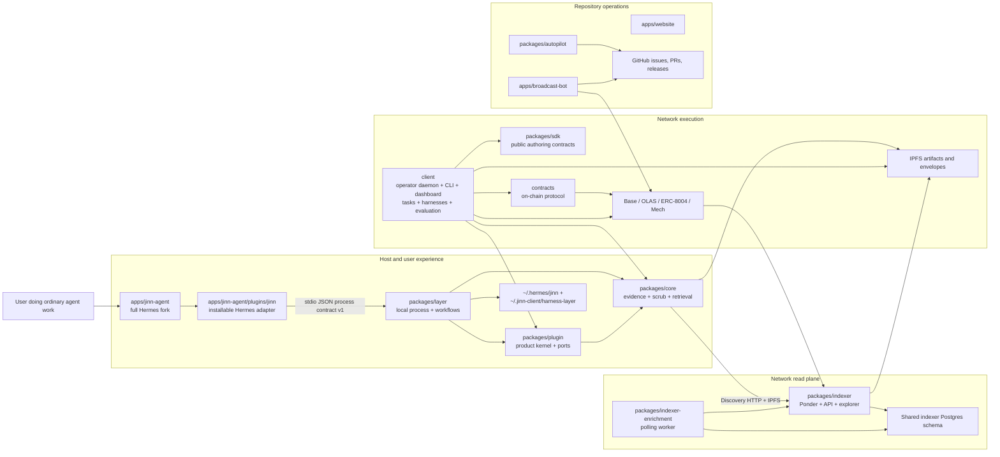
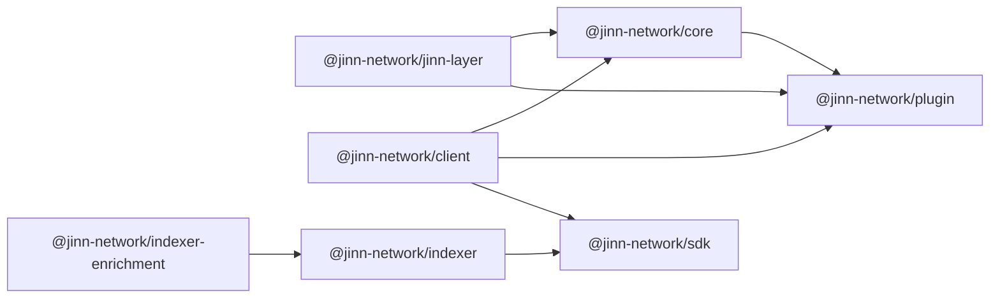
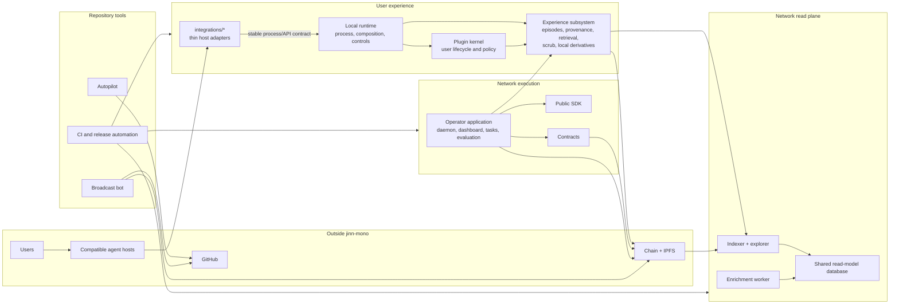

# Jinn Mono: Current Architecture and Proposed Boundaries

**Date:** 2026-07-23

**Status:** **Superseded as a boundary proposal (2026-07-30, DR-2026-07-30).** Its inventory
and system map remain useful history — written before the stack implementation landed, so its
figures predate the current tree. Its proposed boundaries and dispositions are replaced by
[`docs/superpowers/specs/2026-07-30-jinn-platform-architecture.md`](superpowers/specs/2026-07-30-jinn-platform-architecture.md)
§7. The three decisions this map deferred (publication authority, task/evaluation ownership,
package names) are dispositioned there or assigned to the queued product design sessions.
Originally: repository audit and boundary proposal

**Scope:** `jinn-mono` only

**Out of scope:** implementation sequence, migration plan, backward-compatibility plan, and the
internal redesign of the knowledge/experience substrate

## 1. Fixed point and audit method

This map treats one product promise as fixed:

> A user's agent should improve through accumulated shared experience.

Everything currently used to realize that promise is open to challenge: applications, package
boundaries, repositories represented inside this repository, schemas, interfaces, names, and
deployment shapes.

The map follows this evidence order:

1. code that is imported, built, deployed, or exercised;
2. current behavior and recent validated decisions;
3. recent design documents;
4. older specifications and abandoned implementations.

Historical documents are evidence of intent, not architectural authority. This distinction is
load-bearing: the repository contains several generations of product direction, and many documents
still refer to paths or services that no longer exist.

Generated and private working-copy directories such as `.local/`, `.worktrees/`, `node_modules/`,
`dist/`, contract build outputs, and local evidence runs are not components of the source
architecture. They are excluded from the disposition map and must not be deleted as part of a
source cleanup without a separate data-safety decision.

## 2. Executive assessment

`jinn-mono` currently contains four systems that evolved together but do not share one clear
architectural frame:

1. **A user experience system:** a host-specific Jinn plugin, a host-independent plugin kernel,
   local evidence storage and retrieval, distillation, and a local process runtime.
2. **A network execution system:** an operator daemon, dashboard, task marketplace, harnesses,
   evaluation, wallet and earning logic, contracts, and deployment images.
3. **A network read plane:** an indexer, an enrichment worker, an explorer, public discovery APIs,
   IPFS resolution, and chain projections.
4. **Repository operations:** Autopilot, release automation, the broadcast bot, product/growth
   material, and a large body of historical design work.

The main problem is not that these systems coexist. It is that directory and package names obscure
which system owns which responsibility:

- `client` is actually the operator application and network runtime.
- `@jinn-network/plugin` is a host-independent product kernel, not the installable host plugin.
- the installable Jinn plugin is buried inside a 6,062-file fork of Hermes.
- `@jinn-network/core` is local evidence, scrub, trajectory, and corpus-read code, while the product
  roadmap uses “Jinn Core” to mean the much larger network, marketplace, evaluation, and incentive
  substrate.
- `@jinn-network/jinn-layer` is a local executable runtime plus distillation, bridge, publication,
  evaluation preparation, and seed-import workflows. “Layer” does not describe an ownership
  boundary.
- `packages/indexer` and `packages/indexer-enrichment` are deployable services, not reusable
  packages.
- `packages/autopilot` is repository engineering infrastructure, not product code.

Three facts show the scale of the structural noise:

- The repository has **11,739 tracked files**. `apps/jinn-agent` has 6,062 and `legacy/` has 1,918;
  together they are **68% of all tracked files**.
- The active JavaScript/TypeScript system has no root workspace or lockfile. The operator,
  contracts, Autopilot, plugin kernel, evidence core, local runtime, SDK, indexer, enrichment
  worker, and broadcast bot each maintain an independent package-manager island.
- Documentation contains 220 references to the deleted
  `client/packages/harness-layer` path, references to the removed `packages/eng-loop`, and live
  deploy documentation for the absent `packages/claim-relayer`.

The recommended target is therefore not “split everything into more packages.” It is:

- remove vendored and historical mass from the active tree;
- organize active code by application, integration, reusable package, service, contract, or
  repository tool;
- establish one root workspace for first-party JavaScript/TypeScript code;
- give each persistent data set and external interface one owner; and
- leave the exact internal design of the experience/knowledge subsystem to its standalone
  specification.

## 3. Current system map



This diagram shows logical traffic, not every source import. In particular, public publication is
split: `packages/layer` contains capture, publish, skill-publish, bridge, and signing workflows,
while `client` owns wallet access, chain-writing composition, execution envelopes, and several
other publication paths.

## 4. Current applications and deployables

| Current area | What it actually is | Primary interfaces | Assessment |
| --- | --- | --- | --- |
| `client/` | Operator application: daemon, CLI, local API, dashboard SPA, MCP servers, task engine, built-in harnesses, task creation, evaluation, wallet, rewards, and release tooling | `jinn` CLI, loopback HTTP/SSE/WebSocket, MCP, chain RPC, IPFS, indexer APIs, SQLite | Active and essential, but the name and boundary are wrong. At roughly 164k source lines it is several subsystems inside one application tree. |
| `apps/jinn-agent/` | A full fork of upstream Hermes, rebranded as `jinn-agent`, plus the Jinn adapter | Python CLI/TUI/web/gateways, plugin lifecycle, local files, subprocess calls to `jinn-layer` | Active but architecturally disproportionate. The host fork is 6,062 tracked files; the Jinn adapter itself is 21 files plus Jinn-specific tests and assets. |
| `apps/website/` | Static product landing page | Static HTML, manual Vercel deployment | Coherent, small, and correctly isolated. |
| `apps/broadcast-bot/` | Repository/community communications automation | GitHub API, chain RPC, local Claude CLI, X API, GitHub Actions state branch | Coherent and active, but it is repository operations rather than a product application. |
| `packages/indexer/` | Hosted Ponder indexer, public API, and bundled network explorer | Chain RPC, Postgres, GraphQL/HTTP, IPFS, static explorer | Active deployable service incorrectly classified as a package. |
| `packages/indexer-enrichment/` | Separate polling worker for IPFS-bound enrichment | Shared indexer Postgres schema, imports from indexer, IPFS, health HTTP | Its separate process is justified, but it belongs to the same read-plane service boundary as the indexer. |
| `contracts/` | Jinn-owned on-chain protocol and deployment records | Solidity ABI/events, Foundry/Hardhat, chain RPC | Coherent and active. |
| `packages/autopilot/` | Jinn repository engineering and GitHub lifecycle automation | GitHub issues/PRs/projects, git worktrees, agent runtimes, CLI | Active and substantial, but it is an internal tool rather than a publishable product package. |
| `deploy/` | Two hosted operator image overlays | Operator base image, Railway configuration, persistent `/data` | These recipes belong to the operator application; a cross-repository deploy root is not currently justified. |

### The operator application is the dominant mixed boundary

`client/src` currently includes:

- operator surfaces: dashboard, API, CLI, MCP, embedded agent;
- protocol execution: daemon loops, task engine, wallet, earning, chain adapters;
- extension frameworks: SolverNets, solver types, Harnesses, plugins;
- evaluation and benchmark machinery;
- task creation and harvesting;
- corpus, discovery, capture, trajectory, scrub compatibility facades;
- release, deployment, and acceptance infrastructure.

This explains why almost every other package has a client-compatibility workflow and why the
client release process vendors or materializes sibling packages. `client` is not a reusable
library; it is an application containing multiple domains.

### The host fork dominates the repository without owning the product contract

The current product can already install `apps/jinn-agent/plugins/jinn` into stock Hermes. The same
adapter calls the independently published `@jinn-network/jinn-layer`. This means the full fork is
not required to define the Jinn product boundary. Keeping a complete, frequently changing upstream
agent inside the monorepo makes host maintenance appear to be Jinn core development and caused a
large rebranding and merge-maintenance surface.

The existing split workflow further demonstrates the mismatch: it mirrors
`apps/jinn-agent/plugins/jinn/` out to a slim plugin repository, so the true distributable source
is nested inside the vendored host that consumes it.

## 5. Current reusable package map



The dependency graph is acyclic and improved substantially during the recent extraction work.
The remaining problem is semantic ownership, not a circular import.

| Package | Current responsibility | Boundary finding | Proposed disposition |
| --- | --- | --- | --- |
| `@jinn-network/plugin` | Episode and knowledge schemas, ports, pickup/history/outcome/eligibility behavior, in-memory contract kits, plugin factory | This is a host-independent product kernel, not the installable plugin. “Plugin” currently names three different things: this package, the Hermes adapter, and SolverPlugins under `client/plugins`. | Keep the host-independent responsibility, but rename it to make “kernel” or “product core” explicit—or make it the sole canonical meaning of Jinn Plugin and rename the other plugin concepts. |
| `@jinn-network/core` | Evidence filesystem/index, contribution state, scrub stack, corpus reads and cache, trajectory parsers, envelopes, manifests, skills, paired evaluation helper | “Core” is a miscellaneous shared substrate and conflicts with the roadmap's much broader “Jinn Core.” It is already becoming the accidental home of the knowledge redesign. | Refactor and rename around the experience/evidence boundary. Do not decide its final internal model in this audit. Move unrelated protocol/evaluation helpers to their true owners. |
| `@jinn-network/jinn-layer` | Executable process contract, adapters, local capture, retrieval, distillation, seed import, bridges, measurement, publishing, skill packaging, evaluation preparation, and a 2,569-line CLI | The package is both a local runtime and a workflow collection. Local user experience, public publishing, corpus seeding, and benchmark/factory work have different lifecycles. | Keep a small local runtime boundary; split or delete workflows that do not belong to that runtime when the experience and publication designs are revisited. Rename “layer” to its actual role. |
| `@jinn-network/sdk` | Stable public schemas and authoring contracts for Harnesses, SolverNets, checkpoints, plugins, and typed task payloads | This has a clear external consumer and a documented rule: the SDK builds and validates; the operator executes. Some schemas are still mirrored inside `client`. | Keep as the canonical external contract package; eliminate mirrors and ensure services consume its public exports. |

## 6. Current interface ledger

| Interface | Producer → consumer | Current contract | Finding |
| --- | --- | --- | --- |
| Host lifecycle | Hermes adapter → local runtime | `jinn-layer` subprocess, JSON/stdin, process contract v1 with `ok/degraded/unavailable` | Good isolation mechanism. Keep host adapters out of runtime internals. The checked-in contract file is too small to describe the full semantic interface, so parity relies heavily on tests. |
| Plugin composition | Local runtime → plugin kernel and evidence core | Direct TypeScript package imports | Direction is sensible. Names and responsibility allocation are not. |
| Local user state | Host adapter and local runtime → filesystem | Both host-local `${HERMES_HOME}/jinn` and `~/.jinn-client/harness-layer/*` | Ownership is unclear and the `harness-layer` name survives a completed extraction. User-plugin state and operator-node state share the `.jinn-client` root despite having different lifecycles. |
| Corpus discovery | Core/operator → indexer | Custom Discovery HTTP and GraphQL endpoints | The runtime client and server schemas are not owned by one obvious public contract package. Some discovery code moved from indexer to client, leaving responsibility split. |
| Artifact retrieval | Core/operator/indexer → IPFS gateways and origin servers | CIDs, signed envelopes, cache and route-resolution conventions | Fundamental interface, but envelope, episode, skill, capture, and task concepts span several packages. Their replacement is defined outside this repository-level map. |
| Operator UI | Dashboard SPA/MCP/CLI → operator daemon | Loopback HTTP, SSE, WebSocket, CLI JSON | Coherent application-internal boundary. Keep within the operator application unless an external consumer requires a published API. |
| Protocol execution | Operator → contracts/OLAS/Mech/ERC-8004 | Solidity ABI, events, signed transactions | Clear network boundary. Generated ABIs and manifest schemas should have one canonical build output rather than hand-maintained copies. |
| Read-plane enrichment | Enrichment worker → indexer Postgres | Direct writes to the indexer's Ponder schema plus imports from indexer source | Intentionally tight and operationally valid, but these are two deployables inside one service boundary, not independent reusable packages. |
| Plugin distribution | Monorepo workflow → slim plugin repository | Deterministic mirror of the nested Hermes plugin directory | Publication is clear; source ownership is not. The first-party adapter should not live inside the vendored host tree. |
| JavaScript build/release | Independent projects → npm/OCI/CI | Per-project lockfiles, portal dependencies, client vendoring/materialization, path-filtered workflows | The build topology encodes accidental isolation and duplicates dependency resolution. A root workspace should express the intended graph directly. |
| Autopilot | Internal tooling → GitHub and agent hosts | GitHub state, git worktrees, CLI/session adapters | Correctly independent of product packages. Its location under `packages/` misstates its role. |

## 7. Data ownership map

The current system has four legitimate data domains:

1. **Host state:** host configuration, host sessions, and host-native skills.
2. **Jinn user experience:** canonical episodes, local retrieval indexes and caches, distilled
   skills, contribution eligibility, and user-controlled retention/publication state.
3. **Jinn operator node:** wallets, task state machines, marketplace attempts, served artifacts,
   daemon configuration, and operational SQLite state.
4. **Public network:** chain events, IPFS objects, indexer projections, and publication receipts.

The current paths do not preserve those domains. The Jinn user experience stores its canonical
episodes under `~/.jinn-client/harness-layer`, while the network operator also owns
`~/.jinn-client`. The Hermes adapter adds a second root under the host home. This makes it unclear
what disabling a host integration should stop, what uninstalling an operator should retain, and
which data belongs to the future experience corpus.

The proposed ownership rule is:

- the host owns host-native state only;
- the Jinn experience subsystem owns one Jinn user-state root;
- the operator application owns a separate operator-state root;
- public records are immutable external state with local rebuildable projections; and
- indexes and caches are views, never the only copy of valuable evidence.

This audit only reserves the owning boundary. The internal model is defined separately by the
[Jinn Execution Evidence Protocol](superpowers/specs/2026-07-23-jinn-execution-evidence-protocol-design.md).

## 8. Repository-area disposition

Disposition meanings:

- **Keep:** responsibility and location are broadly correct.
- **Refactor:** responsibility remains, but the boundary is too broad or ambiguous.
- **Move:** responsibility is coherent but belongs in a different architectural group.
- **Remove from mono:** retain only a Jinn-owned integration or contract; the containing external
  product should not live in this repository.
- **Delete:** no active architectural role; Git history is sufficient.
- **Defer:** the current boundary is known to be wrong, but this audit intentionally does not
  design the replacement.

| Area | Disposition | Confidence | Reason |
| --- | --- | --- | --- |
| `.github/` | Keep + refactor | High | Active CI/release/ops control plane. Consolidate after a root workspace exists; remove stale legacy path gates and duplicate installation logic. |
| `.claude/skills` with `.codex/skills` and `.cursor/skills` projections | Keep | High | One canonical skill source plus symlinked consumers is a valid repository-tooling pattern. It should remain outside product runtime code. |
| `apps/broadcast-bot/` | Move to repository tools | High | Active and coherent, but it operates this repository/community rather than serving the product runtime. |
| `apps/jinn-agent/` host fork | Remove from mono | High | The complete upstream host is 52% of the repository. Jinn already works as a stock-Hermes plugin. Retain the Jinn adapter, its host-contract tests, and any genuinely Jinn-owned presentation assets; do not retain the full host product here. |
| `apps/jinn-agent/plugins/jinn/` | Move to `integrations/hermes` | High | This is the actual host adapter and slim-distribution source. Its current nesting makes first-party code subordinate to the vendored host. |
| `apps/website/` | Keep | High | Small, active, self-contained product surface. |
| `client/` | Refactor and rename as operator application | High | Essential network runtime, but “client” is misleading and the tree mixes application, domain, extension, benchmark, release, and compatibility code. |
| `contracts/` | Keep | High | Clear protocol ownership and independent toolchain. |
| `deploy/` | Move under the operator application | High | Contains only operator image overlays; deploy material should be co-located with the deployable it configures. |
| `packages/autopilot/` | Move to repository tools | High | Active internal engineering system with no product-library role. |
| `packages/plugin/` | Refactor naming and tighten | Medium | The host-independent product kernel is a valid boundary. Its name collides with host plugins and SolverPlugins. |
| `packages/core/` | Refactor and rename boundary | High on need, medium on final shape | It is the current evidence/experience substrate but also holds unrelated shared helpers. Its internal evidence model is defined in the standalone protocol specification; this map does not assign the code split. |
| `packages/layer/` | Refactor into local runtime plus separately owned workflows | High on need, medium on split | The executable integration runtime is real. Distillation factory, bridge, seed import, benchmark preparation, and public publishing should not automatically share its lifecycle. |
| `packages/sdk/` | Keep | High | Clear public authoring and schema surface. |
| `packages/indexer/` | Move to services | High | Deployed read-plane service, not a reusable package. Keep the explorer with it while they remain one deployable. |
| `packages/indexer-enrichment/` | Move to the indexer service group | High | Preserve the separate worker process but make shared schema/code ownership explicit. |
| `examples/` | Keep | High | External-harness examples validate the SDK and extension story. Example lockfiles are legitimate isolation fixtures. |
| `legacy/` | Delete | High | Explicit 1,918-file historical snapshot with no active code consumer. A few old documents cite it as precedent; Git history is the appropriate archive. |
| `growth/archive/` | Delete | High | Entire directory is an archive, including duplicated rendered assets and presentations. Current growth direction already lives in root canon and active skills. |
| `scratchpad/` | Delete | High | Two tracked working notes have no architectural role. |
| `scripts/_archived/` | Delete | High | Git is the archive. Keep only active repository-wide scripts in the root scripts directory. |
| `docs/`, `spec/`, and `log/decisions/` | Consolidate and prune | High | There are multiple overlapping taxonomies and large numbers of stale path references. Preserve current canon, accepted decisions, active operations, and useful research; remove superseded plans/designs from the active tree after their durable decisions are captured. |
| Root `README.md`, `SPEC.md`, and other canon | Keep + reconcile | High | They are the public authority but currently emphasize the operator/network product while the more recent product direction emphasizes agent improvement through shared experience. Canon must describe one system. |

## 9. Proposed logical architecture



### Target ownership rules

| Boundary | Owns | Must not own |
| --- | --- | --- |
| Host adapter | Host lifecycle hooks, host-native rendering, translation to the stable Jinn runtime contract | Corpus storage, scrub policy, distillation implementation, chain access, or shared product rules |
| Plugin kernel | User lifecycle, pickup/history/outcome policy, permissions, product-facing ports and schemas | Host-specific APIs, persistence implementations, chain wallets, or background service operation |
| Experience subsystem | Canonical evidence/episode model, lineage, local persistence, rebuildable indexes, retrieval, scrub, local derivatives | Host UI, operator wallet/earning, marketplace daemon loops, or repository automation |
| Local runtime | Executable composition of kernel + experience implementations; local CLI/process contract; health and fallback | General network operator responsibilities or unrelated benchmark/factory pipelines |
| Operator application | Task creation/execution/evaluation, operator identity and wallet, daemon state, dashboard, network publication requiring operator authority | Host-specific user-agent integration or canonical local user memory |
| SDK | Stable authoring schemas and pure validation/building helpers | Daemon state, network calls, persistence, or first-party implementation policy |
| Contracts | Jinn-owned on-chain state transitions and events | Off-chain product workflow |
| Read plane | Chain/IPFS projection, discovery API, explorer, asynchronous enrichment | Canonical source evidence or user-local state |
| Repository tools | Engineering and communications automation | Runtime imports from product applications; product code must not depend on repository tools |

### Allowed dependency direction

The target dependency direction is:

```text
integrations/*  --process/API-->  local runtime  -->  plugin kernel
                                      |                    |
                                      +--> experience <----+

operator application  -->  SDK
operator application  -->  experience contracts where genuinely shared
operator application  -->  contracts / public network

indexer + worker  -->  SDK or explicit shared read-plane contracts

repository tools  -->  GitHub / git / public network
product and services  -X-> repository tools
applications          -X-> source files inside other applications
```

No package should import an application source tree. No application should need a custom bundler to
smuggle undeclared sibling sources into its release. Interfaces used across a process or published
package boundary must have one explicit owner.

## 10. Proposed repository map

The following is a high-level target, not an implementation plan. Names inside the experience
subsystem are deliberately provisional.

```text
jinn-mono/
├── apps/
│   ├── operator/                 # current client: daemon, CLI, dashboard, network execution
│   └── website/                  # static product site
├── integrations/
│   └── hermes/                   # current Jinn host adapter, not the full Hermes product
├── packages/
│   ├── plugin/                   # host-independent user lifecycle and product contracts
│   ├── experience/               # reserved boundary; internal design specified separately
│   ├── runtime/                  # local executable composition; current narrow layer role
│   └── sdk/                      # external authoring and schema surface
├── services/
│   ├── indexer/                  # Ponder, discovery API, explorer
│   └── indexer-enrichment/       # separate worker in the same read-plane boundary
├── contracts/                    # on-chain protocol
├── tools/
│   ├── autopilot/                # repository engineering automation
│   └── broadcast-bot/            # repository/community communications automation
├── examples/                     # external integration examples and conformance fixtures
├── docs/                         # current architecture, product/protocol canon, operations,
│                                 # accepted decisions, and active research
├── .github/                      # CI, release, and repository operations
├── package.json                  # one first-party JS/TS workspace
└── yarn.lock                     # one first-party JS/TS dependency resolution
```

Exceptions to the root workspace are legitimate when isolation is the purpose: published external
examples, test fixtures that emulate third-party repositories, Solidity tooling, and non-JavaScript
host adapters. They should be explicit exceptions rather than the default for every first-party
package.

## 11. High-confidence removal boundary

The following source material has no reason to remain in the active architecture:

- `legacy/jinn-cli-agents-reference/`;
- `growth/archive/`;
- `scratchpad/`;
- `scripts/_archived/`; and
- the non-Jinn-owned portion of the full `apps/jinn-agent` fork once the thin adapter, adapter
  tests, and required Jinn-owned assets have a first-party home.

Git history remains the archive for all of these.

The following should not be deleted blindly:

- local transcripts, canonical episodes, curated corpus inputs, and distillation outputs;
- secrets, wallet material, deployment state, or operator databases;
- IPFS objects and on-chain records;
- accepted decisions that are not yet represented in current canon; and
- compatibility facades that still have live imports until their ownership has been resolved.

Pre-launch freedom removes the need to preserve public code/API compatibility. It does not remove
the need to preserve valuable evidence and irreversible external state.

## 12. Deferred decisions

This map intentionally leaves three decisions open:

1. **Publication authority.** Public publishing is currently split between the local runtime and
   operator application. The future design must decide whether publication requires an operator,
   a separate network client, or a daemon-less user path.
2. **Task and evaluation ownership.** Task definitions, task creation, evaluator implementations,
   benchmark machinery, and SDK schemas currently span `client` and `sdk`. Their final package
   boundary should follow actual external consumers.
3. **Exact package names.** `plugin`, `core`, `layer`, and `client` are overloaded. The proposed
   role names are more important than preserving any current npm name.

Those questions should be answered after this high-level map is accepted. Answering them inside
this audit would recreate the same confusion at a more detailed level.

## 13. Bottom line

The cleanest reading of `jinn-mono` is:

- **the product promise** lives in the plugin experience;
- **agent hosts are external dependencies** reached through thin adapters;
- **the operator is a network application**, not the product's generic “client”;
- **contracts and the read plane are network infrastructure**;
- **Autopilot and the broadcast bot are repository tools**;
- **the full host fork and explicit archives do not belong in the active tree**; and
- **knowledge belongs behind one experience-subsystem boundary**, whose internal design is
  maintained in its own specification.

This boundary map reduces the active repository from a collection of historical products and
package experiments into one user experience, one network runtime, one read plane, and a clearly
separated set of repository tools.
