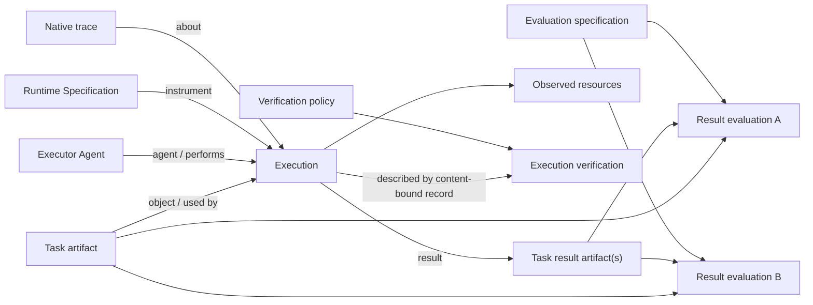

# Jinn Execution Evidence Protocol v1

> **Status:** Design rationale. The implemented normative profile, schemas, fixtures, and
> reference validator live in
> [`packages/evidence-protocol`](../../../packages/evidence-protocol/README.md). Where this
> rationale and the packaged profile differ, the packaged profile is authoritative.

**Date:** 2026-07-23

**Status:** semantic contract closed; machine schemas, validators, and published profile pending

**Scope:** the stable evidence substrate shared by Jinn producers, stores, and consumers

**Out of scope:** implementation sequence, migration plan, storage-engine selection, query APIs,
retrieval algorithms, task-marketplace mechanics, evaluator implementations, and derived knowledge
products

## 1. Decision

Jinn's base knowledge layer is a portable **execution-evidence protocol**, not a generic knowledge
store and not a single episode object.

It describes:

- the task or intended work;
- the identified Executor Agent that performed the work;
- the reusable Runtime Specification and runtime artifacts;
- an observed execution;
- the inputs used and task results produced;
- the native trajectory and factual resource observations;
- later evaluations of the task/result pair;
- later verifications of how the execution occurred; and
- the provenance connecting those entities and claims.

Retrieval packets, benchmark rows, training datasets, reports, and skills are projections derived
from this evidence. They do not belong in the base protocol.

The protocol is complete rather than staged: local/private and published evidence use the same
profiles. “Complete” means that the protocol has a stable place and semantics for every concern,
not that every execution can observe every optional fact.

## 2. Protocol boundary

The protocol owns:

- evidence entity types and relationships;
- portable packaging and content identity;
- conformance profiles and validation;
- provenance and derivation semantics;
- the subjects and meaning of evaluation and verification claims; and
- versioning rules for those semantics.

The protocol does not own:

- a database, filesystem layout, hosted registry, retention limit, or deletion policy;
- corpus admission, contribution eligibility, consent, publication, or retrieval visibility;
- ranking, search, recommendation, or task-marketplace policy;
- evaluator implementations, execution harnesses, or runtime orchestration; or
- distilled skills and other derived knowledge products.

Several local or hosted stores may contain the same conforming records. Storage behavior and
store APIs are not part of the interchange contract. The protocol defines content identities;
filesystems, databases, registries, publishers, and applications decide how those identities are
persisted, resolved, indexed, retained, or removed.

## 3. Standards composition

Jinn owns a small family of profiles that compose established standards. It does not replace their
native formats.

| Concern | Standard or native format | Jinn's responsibility |
| --- | --- | --- |
| Portable evidence graph and package | [RO-Crate 1.3](https://www.researchobject.org/ro-crate/specification/1.3/introduction.html), JSON-LD | Require RO-Crate as the canonical execution-evidence carrier, identify the primary entities, and publish a Jinn conformance profile. |
| Process execution | [Process Run Crate 0.5](https://www.researchobject.org/workflow-run-crate/profiles/process_run_crate/) patterns and workflow-run vocabulary | Reuse `SoftwareApplication`, `CreateAction`, `instrument`, `object`, `result`, environment, container, and resource-usage conventions. |
| Provenance and lineage | [W3C PROV-O](https://www.w3.org/TR/prov-o/) within the crate | Reuse activities, entities, agents, usage, generation, and derivation relationships. |
| Authenticated claims | [in-toto Attestation Framework v1](https://github.com/in-toto/attestation/blob/main/spec/README.md) and [DSSE v1](https://github.com/secure-systems-lab/dsse/blob/master/envelope.md) | Bind claims to immutable subjects and define only the missing Jinn evaluation and verification predicates. |
| Execution trajectory | [OpenTelemetry traces](https://opentelemetry.io/docs/specs/otel/trace/) or another declared native trace artifact | Preserve the source trace without forcing every producer into a lossy Jinn step array; record its media type and schema version. |
| Runtime and code environment | OCI image/runtime specifications when applicable, plus native Git, lockfile, devcontainer, Nix, or other declared artifacts | Reference immutable environment artifacts and record observed per-run overrides. Do not invent a universal runtime format. |
| Task and result payloads | Domain-native formats such as benchmark task JSON, Git commits, patches, test reports, and files | Preserve native bytes and describe their role in the evidence graph. |

Process Run Crate 0.5 formally extends RO-Crate 1.1. Jinn targets RO-Crate 1.3, so a Jinn crate
MUST NOT claim Process Run Crate 0.5 conformance merely because it uses the same model. Jinn's
profile restates the required Process Run patterns against RO-Crate 1.3 and credits their origin.
This avoids a false version claim while preserving interoperability.

Jinn also reuses the workflow-run `resourceUsage` term without adopting Provenance Run Crate's
formal-workflow and step-execution model. Agent turns and tool calls remain in the native trace.

An attached crate, a detached metadata document, and content-addressed component objects are valid
storage or transport forms of the same evidence. They are not different protocol tiers.

## 4. Record families and relationships

There are three record families:

1. **Execution Evidence**, an RO-Crate describing what was run and what happened.
2. **Result Evaluation Evidence**, a signed in-toto Statement about a Task and its Results.
3. **Execution Verification Evidence**, a signed in-toto Statement about one content-bound
   Execution Evidence record.

Evaluations and verifications are independent records. “Appending an evaluation” means adding a
new claim to the logical evidence graph or store; it never means editing the earlier execution
crate.



Cardinalities are deliberately non-containing:

- a Task may have many Executions;
- an Executor Agent may perform many Executions;
- a Runtime Specification may be cited by many Executions;
- an Execution has one primary Task, Executor Agent, and Runtime Specification, may consume many
  other inputs, and may produce many task Result artifacts;
- a Task/Result set may receive any number of evaluations; and
- an Execution Evidence record may receive any number of, potentially conflicting, verifications.

## 5. Identity and immutability

The protocol distinguishes three kinds of identity.

| Identity | Meaning | Rule |
| --- | --- | --- |
| Historical entity identity | Names an Executor Agent, Execution, Agent, or other real-world entity in the evidence graph | Use an absolute persistent IRI where available; otherwise use a `urn:uuid:` IRI. It is not a content hash. |
| Artifact identity | Binds exact task, result, trace, code, policy, or other bytes | Use SHA-256 over the exact bytes, expressed as an algorithm/digest pair. |
| Evidence-record identity | Binds one serialization of an execution crate or attestation | For an execution crate, SHA-256 the exact UTF-8 bytes of `ro-crate-metadata.json`; for an attestation, SHA-256 the exact DSSE envelope bytes. |

### 5.1 Agent identity

The base protocol is identity-scheme neutral. It follows JSON-LD and PROV-O by identifying an
Agent with an IRI without prescribing whether that IRI comes from a web domain, DID method,
registry, blockchain, or local producer.

Every Agent named by a protocol record—including an Executor Agent, record creator, Evaluator,
Verifier, or transformation agent—MUST have a stable absolute IRI. Public Agents SHOULD use a
persistent, dereferenceable IRI where practical. An Agent without an established public
identifier MAY use a generated `urn:uuid:` IRI. Blank-node identifiers and unqualified strings
are not conforming Agent identities because other evidence records cannot refer to them
unambiguously.

An Agent MAY carry:

- `identifier` values for identifiers issued by external systems;
- typed `PropertyValue` identifier records whose `propertyID` is an absolute IRI naming the
  external scheme and whose `value` has that scheme's native representation; and
- `sameAs` links to IRIs that identify exactly the same Agent.

`sameAs` MUST NOT be used merely because an account, wallet, key, organization, or service
controls, authenticates, employs, or operates the Agent. Those are relationships or evidence
binding an identity, not identity equivalence.

An Agent IRI answers “who is claimed?” It does not establish control, authorship, authorization,
or trust. A signature authenticates record bytes to a key; a registry entry, delegation,
certificate, verification, or consumer trust policy may bind that key or account to the claimed
Agent. Consumers MUST NOT infer such a binding from the identifier alone.

Profiles layered above this protocol MAY define canonical mappings for particular identity
systems. For example, a future marketplace profile may map an ERC-8004 registry and agent ID to
the Agent IRI and attach its wallet or registry evidence. The base protocol does not privilege
that mapping or treat a wallet as the Agent identity.

Every byte-bearing artifact named by this protocol MUST carry a SHA-256 digest over its exact
bytes. Native identifiers and locators—including Git object identifiers, OCI references, IPFS
CIDs, package versions, and URLs—MAY be retained in addition to SHA-256, but do not replace it.
Historical entities such as Agents and Executions use IRIs rather than artifact digests.

For an unavailable opaque implementation, the producer MUST NOT invent a digest. It instead
creates and content-binds an exact observation descriptor containing the provider, service or
deployment identifier, observed version and parameters, available request identifiers or
attestations, and known limitations. The descriptor digest commits to the producer's observation;
it is not a digest of the unavailable implementation.

For a multi-file artifact, every included file MUST carry SHA-256 and the aggregate MUST be bound
through an exact manifest that enumerates its members, names, and digests. The manifest itself
MUST carry SHA-256.

`ro-crate-metadata.json` is a Jinn profile manifest: every contained or referenced byte-bearing
payload entity MUST carry SHA-256. The metadata digest therefore binds the graph and the exact
payload identities without requiring JSON-LD canonicalization. The metadata file does not contain
its own digest.

Whitespace or key-order changes create different evidence-record bytes and therefore a different
record digest, even if the JSON-LD graph is equivalent. That is intentional. The historical
Execution identity remains the same.

Evidence records are immutable under their content identifiers. A correction, re-evaluation,
refutation, or scrubbed representation creates another record with explicit provenance. A content
identity identifies exactly one byte sequence; bytes that do not match the declared digest are
not that object. Stores may retain or delete copies, update aliases, or rebuild indexes according
to their own policy.

The textual Jinn convention for an algorithm/digest pair is `sha256:<64 lowercase hex digits>`.
Inside an in-toto Resource Descriptor the standard `{ "digest": { "sha256": "<hex>" } }` shape is
used.

## 6. Execution Evidence Profile

**Target profile URI:** `https://jinn.network/profiles/execution-evidence/1.0`

This URI is reserved by this design. It MUST resolve to the published human-readable profile
before a producer emits an external conformance claim under it.

### 6.1 Required graph

| Entity | Cardinality | Required role |
| --- | ---: | --- |
| RO-Crate Metadata Descriptor | exactly 1 | Declares RO-Crate 1.3 and points to the Root Dataset. |
| Root Dataset | exactly 1 | Declares Jinn profile conformance, lists packaged payloads, and mentions the primary Execution. |
| Task | exactly 1 per Execution | Immutable plan/instruction artifact consumed by the Execution. |
| Executor Agent | exactly 1 per Execution | Identified Agent that directly performed the work. |
| Runtime Specification | exactly 1 primary per Execution | Reusable software/configuration graph used as the Execution's `instrument`. |
| Execution | exactly 1 primary per crate | Historical run, represented as `CreateAction` and `prov:Activity`. |
| Other Inputs | 0..N | Repository state, provided knowledge, config, data, or other entities actually consumed. |
| Result | 0..N | Task outputs; a completed Execution MUST have at least one. |
| Native Trace | exactly 1 primary entity | File or collection describing how the Execution unfolded. |
| Resource Observations | 1..N | Duration is required; tokens, cost, and other measurements are optional when not observed. |
| Capture/derivation provenance | 1..N | Identifies the producer/importer and transformations that created this evidence record. |

A failed or abandoned Execution may have no Result. Lifecycle completion does not mean task
success; correctness belongs only in Result Evaluation Evidence.

### 6.2 Metadata Descriptor and Root Dataset

The top-level `@context` MUST include:

```json
[
  "https://w3id.org/ro/crate/1.3/context",
  "https://w3id.org/ro/terms/workflow-run/context",
  { "prov": "http://www.w3.org/ns/prov#" }
]
```

The Metadata Descriptor MUST:

- have `@id: "ro-crate-metadata.json"` and `@type: "CreativeWork"`;
- have `conformsTo: { "@id": "https://w3id.org/ro/crate/1.3" }`; and
- have `about` pointing to the Root Dataset.

The Root Dataset MUST:

- have `@type: "Dataset"`;
- use `@id: "./"` for an attached crate or an absolute persistent URI for a detached crate;
- have `name`, `description`, `datePublished`, and `license` as required by RO-Crate 1.3;
- declare `conformsTo` the exact Jinn profile URI;
- use `hasPart` for every payload physically included in the crate; and
- use `mentions` to identify the primary Execution;
- identify the evidence producer with `creator`; and
- record evidence creation time with `dateCreated`.

For a local crate, `datePublished` is the time the crate serialization was sealed; it does not
mean the record was released to the public. `license` states permitted use but does not replace
consent, publication, or access policy.

The profile URI itself MUST be represented as a contextual entity of types `CreativeWork` and
`Profile`, as required by RO-Crate 1.3 profile conventions.

### 6.3 Task

The primary Task MUST:

- have types `File`, `CreativeWork`, and `prov:Plan`;
- have `name`, `encodingFormat`, and SHA-256;
- preserve the exact instructions or task specification available to the executor; and
- appear in the Execution's `object`.

Repository, base commit, attachments, and contextual knowledge are separate inputs, not fields
folded into a task summary. If an importer only has a summary, that exact summary becomes the Task
artifact and the import provenance records that the original task body was unavailable.

### 6.4 Executor Agent and Runtime Specification

The Executor Agent is the identified person, organization, or software Agent that directly
performed the work. It is distinct from the reusable runtime machinery it used. The Execution's
`agent` MUST reference exactly one primary Executor Agent. Other standard provenance
relationships MAY describe initiators, delegation, organizations, or participants when known,
but the Jinn base profile defines no additional required actor-role taxonomy.

The Executor Agent MUST have a type compatible with `prov:Agent`: `Person`, `Organization`, or
`prov:SoftwareAgent`. A software Executor Agent MAY additionally be described as a
`SoftwareApplication` when that accurately reflects the entity.

A Runtime Specification is the reusable subgraph rooted at the primary `SoftwareApplication`. It
is not necessarily one monolithic JSON object.

The primary Runtime Specification MUST have:

- `@type: "SoftwareApplication"`;
- an immutable `@id`, or a packaged specification entity with SHA-256;
- `name` and a machine-readable `softwareVersion`; and
- immutable references to the code and runtime components necessary to identify what was intended
  to run.

The producer MUST content-bind every runtime component it controls, including effective
workflow, prompt, skill, plugin, tool, and configuration artifacts that materially affected the
Execution. An opaque hosted component MAY instead be represented by its provider, service URI,
model or deployment identifier, advertised version, effective parameters, and any available
provider attestation. The producer does not invent a digest for unavailable implementation bytes.
Such a declaration can support conforming evidence of what was invoked, while independently
reproducible execution requires the unavailable component to be recoverable or faithfully
substitutable.

It SHOULD use established fields such as `softwareRequirements`, `codeRepository`,
`runtimePlatform`, and workflow-run `containerImage`. Source bundles, lockfiles, container images,
devcontainers, Nix closures, model configurations, plugins, and harness settings remain in their
native formats.

The Runtime Specification describes reusable intended configuration and MAY be referenced by many
Executions. The Execution records observed effective values and overrides. A declaration in the
Runtime Specification is not proof that a particular Execution used it.

### 6.5 Execution and Runtime Observation

The primary Execution MUST:

- have a `urn:uuid:` IRI as `@id`;
- have types `CreateAction` and `prov:Activity`;
- use `instrument` to reference the primary Runtime Specification;
- use `object` to reference the Task and every other known input actually consumed;
- use `result` only for task Result artifacts, not for traces or resource observations;
- have `startTime`, `endTime`, and `actionStatus`;
- use `agent` to identify the Executor Agent that directly performed the work; and
- link observed runtime facts and overrides using the workflow-run `environment`,
  `containerImage`, and native runtime-artifact conventions as applicable.

Runtime Observation is the effective, per-Execution counterpart to the reusable Runtime
Specification. It includes observed environment values, resolved versions, container identity,
model deployment and parameters, resource or sandbox limits, and other material overrides when
available. Runtime Observation is an entity or set of entities within Execution Evidence, not a
fourth top-level record family. Identical content-bound runtime artifacts may be referenced by
more than one Execution.

Allowed lifecycle status values are:

- `https://schema.org/CompletedActionStatus`;
- `https://schema.org/FailedActionStatus`; and
- `https://jinn.network/terms/AbandonedActionStatus`.

`error` MAY explain failure or abandonment. No status value claims that the Result is correct,
accepted, or useful.

If sensitive inputs cannot be packaged, they MAY be represented by an opaque entity carrying a
digest and access classification. Omission is not allowed when the producer knows the input
materially affected the Execution; bytes may be withheld, but the fact of use remains.

### 6.6 Results

A Result is a `File`, `Dataset`, or `Collection` that purports to answer or satisfy the Task.
Each Result MUST:

- be referenced by the Execution's `result`;
- have SHA-256 over the exact Result bytes or exact aggregate manifest;
- point back to the Execution with `prov:wasGeneratedBy`.

A Result File MUST declare its native `encodingFormat`. A multi-file Result MUST enumerate its
parts with `hasPart`, give every included File its own SHA-256, and identify a main entity when the
native format has one.

For repository work, a patch, commit, or immutable repository tree is normally the Result.
The final assistant response may be an additional Result when it is itself part of the requested
deliverable.

Logs, trace data, and test reports produced incidentally during execution are execution evidence,
not task Results. A domain task may still designate one of those formats as its intended Result.

### 6.7 Native trace and observations

The primary native trace MUST be a `File`, `Dataset`, or `Collection` with:

- `conformsTo` the exact native trace/profile version;
- `about` referencing the Execution; and
- content-bound identity.

A trace File MUST have `encodingFormat` and SHA-256. A multi-file trace uses `hasPart`, gives
every included File its own SHA-256, and binds the collection through a packaged manifest File or
another exact aggregate manifest carrying SHA-256.

The trace SHOULD be preserved in the producer's richest native form. Conversion creates a derived
artifact and records the parser, parser version, source digest, and transformation activity.
Individual turns and tool calls are not expanded into RO-Crate graph entities.

Resource observations use workflow-run `resourceUsage` links to `PropertyValue` entities.
Duration in milliseconds is required. Input tokens, output tokens, cache use, monetary cost, and
other measurements are added only when observed. Each measurement MUST include `name`, `value`,
and a unique `propertyID`; it SHOULD include `unitCode` except for dimensionless quantities.
They are factual observations, not evaluations.

### 6.8 Capture and derivation provenance

The Root Dataset's `creator` MUST identify the software or person that assembled the evidence
record. A directly captured record needs no invented predecessor.

Every imported, converted, corrected, or scrubbed entity MUST:

- reference its predecessor with `prov:wasDerivedFrom`;
- reference a transformation `prov:Activity` through `prov:wasGeneratedBy`; and
- identify the transformation implementation, version, policy or configuration, and completion
  time through standard PROV and RO-Crate relationships.

If a predecessor is private or unavailable, its digest-only entity is sufficient. Provenance
asserts derivation; it does not require public access to source bytes. Such an entity uses a local
contextual `@id`, carries the `sha256` value, and MAY carry `identifier:
"sha256:<hex>"`; the textual digest convention is not itself treated as a resolvable URI.

### 6.9 Conformance rule

A crate conforms only if all required entities, relationships, immutable artifact identities, and
provenance are present. Conformance says that the record is structurally interpretable. It does
not imply:

- reproducibility;
- result correctness;
- process integrity;
- permission to publish;
- corpus eligibility; or
- trust in the named producer.

Those are separate claims or application policies.

### 6.10 Conformance, integrity, signatures, identity, and trust

The protocol distinguishes conclusions that consumers often collapse:

1. **Profile conformance:** the record has the required syntax, entities, relationships, and
   content identities.
2. **Artifact integrity:** each available artifact's bytes match its declared digest.
3. **Signature validity:** a claim signature is mathematically valid for a supplied public key.
4. **Identity binding:** external evidence connects that key to the claimed Agent.
5. **Consumer trust:** an application decides that the Agent and claim are acceptable for its
   purpose.

A successful earlier check never implies a later one. In particular, a conforming or correctly
signed record may be false, untrusted, or unsuitable for a given market.

A protocol conformance checker is ordinary deterministic software, not an ecosystem actor or a
fourth evidence family. Stores and applications MAY retain its operational reports, but those
reports are not canonical Execution Evidence. Identity profiles, markets, and consumers define
key resolution and trust policy above this protocol.

## 7. Result Evaluation Evidence

**Predicate type:** `https://jinn.network/attestations/result-evaluation/v1`

A Result Evaluation is an in-toto Statement v1 in a DSSE v1 envelope. The Statement's subjects
MUST be the exact Task artifact and every Result artifact covered by the verdict. Every subject
has a unique `name` and SHA-256 digest.

The predicate has a small required core:

| Field | Type | Meaning |
| --- | --- | --- |
| `evaluatedAt` | RFC 3339 timestamp | When this evaluation was made. |
| `evaluator.id` | absolute IRI | Claimed evaluator Agent identity under Section 5.1. |
| `taskSubject` | string | Name of the one Task entry in the Statement's `subject` array. |
| `resultSubjects` | non-empty string array | Names of all Result entries covered by the verdict. |
| `verdict` | `pass`, `fail`, or `inconclusive` | Evaluator's conclusion about whether the Results satisfy the Task. |

The named task and result subjects MUST resolve to entries in the Statement subject array; names
MUST be unique. The predicate does not duplicate their digests.

The predicate MAY additionally contain:

| Field | Type | Meaning |
| --- | --- | --- |
| `evaluationSpecification` | Resource Descriptor with digest | Exact rubric, tests, or policy applied. |
| `evaluationMethod` | Resource Descriptor with digest | Exact descriptor of how the evaluation was performed. |
| `measurements` | array | Typed criterion names, values, and optional units. |
| `evidence` | Resource Descriptor array | Test reports or other evidence inspected. |
| `explanation` | non-empty string | Human-readable basis for the verdict. |
| `limitations` | string array | Known uncertainty or scope limits. |
| `supersedes` | Resource Descriptor array | Earlier claims this issuer intends this claim to replace. |
| `disputes` | Resource Descriptor array | Earlier claims this issuer explicitly challenges. |

If `evaluationMethod` is present, its exact descriptor bytes are content-bound. The descriptor
SHOULD content-bind every controlled code, model, harness, prompt, tool, and configuration
component and SHOULD precisely describe opaque human or hosted components and known limitations.
The descriptor digest commits to the declaration; it does not make an opaque implementation
available.

The base protocol does not require a specification, method, evidence, explanation, or measurement
threshold. Markets and other application profiles MAY require any of those optional fields for
admission, payment, reputation, or trust.

Each supplied measurement object MUST have a stable string `name` and a JSON scalar `value`;
`unit` is an optional string. Additional measurement metadata is allowed under `annotations`.

For a multi-file Result, the Statement subject is the content-bound Result manifest plus any
individual files whose bytes the verdict addresses directly. The predicate's `resultSubjects`
lists every such subject.

Every supplied byte-bearing Resource Descriptor MUST carry SHA-256. A URI MAY additionally locate
the artifact.

The DSSE envelope MUST have `payloadType: "application/vnd.in-toto+json"`, contain the serialized
Statement as its payload, and contain at least one signature. Signature validity authenticates
bytes and a key; whether that key is trusted for a particular evaluator identity is consumer
policy.

An evaluation judges the Task/Result pair. It does not judge the method used to produce the
Result. Tests run during an Execution become an evaluation only when an identified evaluator
emits this claim. A declared specification and method make that claim more interpretable but are
not base-profile conformance requirements.

## 8. Execution Verification Evidence

**Predicate type:** `https://jinn.network/attestations/execution-verification/v1`

An in-toto subject must be a content-bound artifact, not an abstract historical event. Therefore
the subject of Execution Verification is the exact `ro-crate-metadata.json` for an Execution
Evidence record. The predicate names the primary Execution inside it.

The predicate has the following required core:

| Field | Type | Meaning |
| --- | --- | --- |
| `verifiedAt` | RFC 3339 timestamp | When verification occurred. |
| `verifier.id` | absolute IRI | Claimed verifier Agent identity under Section 5.1. |
| `executionId` | absolute IRI | Primary Execution identity in the subject metadata. |
| `verdict` | `verified`, `rejected`, or `inconclusive` | Verifier's conclusion about the Execution record. |

The Statement MUST have exactly one subject named `ro-crate-metadata.json`, carrying its SHA-256.
The DSSE requirements are the same as Result Evaluation Evidence.

The predicate MAY additionally contain:

| Field | Type | Meaning |
| --- | --- | --- |
| `verificationPolicy` | Resource Descriptor with digest | Exact process policy applied. |
| `verificationMethod` | Resource Descriptor with digest | Exact descriptor of how verification was performed. |
| `checks` | array | Named checks with `pass`, `fail`, or `unknown` status. |
| `explanation` | non-empty string | Human-readable basis for the overall verdict. |
| `limitations` | string array | Known uncertainty or scope limits. |
| `supersedes` | Resource Descriptor array | Earlier claims this issuer intends this claim to replace. |
| `disputes` | Resource Descriptor array | Earlier claims this issuer explicitly challenges. |

If `verificationMethod` is present, the controlled/opaque component rules for
`evaluationMethod` apply. Each supplied check MUST contain `name` and `status`; it MAY contain an
`explanation`, an `evidence` Resource Descriptor array, and additional metadata under
`annotations`. Every supplied byte-bearing Resource Descriptor MUST carry SHA-256.

The base protocol sets no verification-evidence threshold. Markets and other application profiles
MAY require a policy, method, checks, evidence, explanation, or other fields.

Verification covers claims about how work occurred: trace integrity, allowed tools, authorized
identity, environment integrity, originality, policy compliance, or similar process properties.
It does not assert Result correctness.

A good Result may have a rejected verification, and a correctly followed process may produce a
failed Result. Keeping those axes separate is a protocol invariant.

## 9. Append-only composition

An Execution Evidence crate is sealed once identified. Later claims compose as follows:

```text
execution record digest
├── result evaluation A digest
├── result evaluation B digest
├── execution verification A digest
└── execution verification B digest
```

The edges are indexed from the attestations' subjects. The execution crate does not need to know
about future claims.

Without an explicit relationship, claims over the same subjects are independent, even when their
verdicts conflict. An optional `supersedes` relationship communicates that the new issuer intends
the new claim to replace an earlier claim. An optional `disputes` relationship communicates an
explicit challenge without replacement. Both reference the exact earlier DSSE envelope through a
Resource Descriptor carrying SHA-256.

These relationships do not mutate, hide, or delete earlier claims. Whether a supersession is
accepted—for example, only when both records authenticate to the same Evaluator or Verifier—is
consumer policy. A claim issuer that withdraws an earlier verdict without a replacement outcome
may issue an `inconclusive` claim that `supersedes` it.

Download bundles, corpus membership, dataset releases, and collection manifests are transport or
application concerns outside this profile. Packaging several immutable records together does not
create another Jinn evidence-record family.

## 10. Scrubbing and public representation

This section defines derivation semantics, not a scrubber's detection rules, safety policy, or
implementation.

Exact historical roles never transfer to transformed bytes. The Task is the exact plan consumed,
the Result is the exact artifact produced, the native trace is the exact source trajectory, and
the Runtime Specification and other inputs identify the exact artifacts that materially affected
the Execution. A scrubber MUST NOT substitute transformed artifacts into those roles.

Scrubbing instead creates new derived entities and a new **representation of the same historical
Execution**, not a second Execution. A conforming public crate:

- has a new evidence-record digest and, if it uses a persistent Root Dataset URI, a new URI;
- retains the same historical Execution `@id`;
- retains the exact identities and SHA-256 commitments of the Task, Result, native trace, Runtime
  Specification, and other required private artifacts;
- MAY withhold the exact private bytes while describing their media type, access limitation, and
  digest;
- MAY include scrubbed artifacts with new identities and digests, but links them to their exact
  sources with `prov:wasDerivedFrom` and to the scrub transformation with
  `prov:wasGeneratedBy`;
- does not identify a scrubbed derivative as an `object` consumed by, `result` generated by,
  primary native trace of, or Runtime Specification used by the historical Execution;
- links the public Root Dataset to the private record commitment with `prov:wasDerivedFrom`; and
- records a scrub transformation activity, scrubber implementation, policy digest, timestamp,
  per-class disposition counts, and source-to-derived artifact mappings.

This lets a public record preserve exact commitments without publishing exact bytes. It does not
make the private evidence independently reproducible by a consumer that lacks access. If
publishing even an exact digest commitment or the remaining structure is unsafe, no conforming
public Execution Evidence record is published; an application may publish a non-protocol summary
or view later.

Claims do not transfer merely because two crates describe the same Execution:

- a Result Evaluation remains applicable only to the exact Task and Result subject digests it
  names, whether or not their bytes are publicly available; and
- an Execution Verification of the private metadata does not verify the public metadata. A
  verifier must issue a separate claim for the public record if one is needed.

Scrubbing and publication are distinct:

- **scrubbing** derives different safe bytes and a new record digest;
- **publication** copies an unchanged conforming record to another store.

Neither operation grants contribution eligibility, retrieval visibility, consent, or quality.
Those remain application policy.

Scrubbers MUST understand protocol structure before assigning secrecy based on entropy alone.
Digests, DSSE payloads and signatures, public keys, immutable content identifiers, package
versions, and declared model identifiers are expected high-entropy technical values. Their
structural role does not make every value safe, but it must be evaluated before redaction.

A signed envelope is immutable evidence. A scrubber MUST NOT rewrite its payload, signature, or
subject digests in place. Unsafe material is scrubbed before signing and receives a new claim, or
the existing claim is withheld from publication. If a Result must change during public
derivation, an evaluation over the private Result does not transfer to the new bytes.

## 11. Worked example

This example is a minimized, fully synthetic projection of the structure observed in a real local
code-changing episode. It preserves the useful shape—user task, repository input, executor,
tool-rich trace, patch result, tests, and later review—while retaining no source identifiers,
repository names, paths, timestamps, conversation text, or artifact bytes.

### 11.1 Logical package

```text
private-execution/
  ro-crate-metadata.json
  task/task.md
  inputs/base-tree.txt
  runtime/runtime-specification.json
  results/slug-normalization.patch
  trace/trajectory.json
  evidence/in-run-tests.json

claims/
  evaluation-tests.dsse.json
  evaluation-review.dsse.json
  verification-trace.dsse.json

public-execution/
  ro-crate-metadata.json
  task/task.md
  inputs/base-tree.txt
  runtime/runtime-specification.json
  results/slug-normalization.patch
  trace/trajectory.scrubbed.json
  evidence/in-run-tests.json
  provenance/scrub-receipt.json
```

The Task asks for deterministic slug normalization and regression tests. The base repository tree
and one knowledge packet are inputs. `Example Coding Agent` is the Executor Agent and
`Example Coding Runtime 1.2.0` is the Runtime Specification. One Execution produces a patch
Result. Its native trajectory and in-run test report are evidence about the Execution, not
Results.

### 11.2 Core graph

| Subject | Types | Required links |
| --- | --- | --- |
| `task/task.md` | `File`, `CreativeWork`, `prov:Plan` | SHA-256; appears in Execution `object`. |
| `urn:example:runtime:sha256:6b…` | `SoftwareApplication` | Runtime Specification; name/version; immutable code and runtime refs. |
| `urn:uuid:33333333-3333-4333-8333-333333333333` | `prov:SoftwareAgent` | Executor Agent referenced through Execution `agent`. |
| `urn:uuid:11111111-1111-4111-8111-111111111111` | `CreateAction`, `prov:Activity` | Instrument Runtime Specification; objects Task, base tree, knowledge input; result patch; Executor Agent; times; status. |
| `results/slug-normalization.patch` | `File` | SHA-256; `prov:wasGeneratedBy` Execution. |
| `trace/trajectory.json` | `File` | SHA-256; conforms to `jinn.trajectory.v1`; about Execution. |
| `evidence/in-run-tests.json` | `File` | SHA-256; about Execution; not in `result`. |
| `#duration-ms` | `PropertyValue` | `name: durationMs`, integer value, stable `propertyID`, millisecond `unitCode`; linked through `resourceUsage`. |

The private execution metadata is sealed and addressed by its SHA-256, represented below as
`PRIVATE_METADATA_SHA256`.

### 11.3 Two later result evaluations

The automated evaluation Statement has subjects:

```json
[
  {
    "name": "task/task.md",
    "digest": { "sha256": "TASK_SHA256" }
  },
  {
    "name": "results/slug-normalization.patch",
    "digest": { "sha256": "PATCH_SHA256" }
  }
]
```

Its result-evaluation predicate says:

```json
{
  "evaluatedAt": "2026-07-23T14:00:00Z",
  "evaluator": {
    "id": "urn:example:evaluator:tests"
  },
  "evaluationMethod": {
    "name": "fixture-test-evaluator",
    "digest": { "sha256": "TEST_EVALUATOR_SHA256" }
  },
  "evaluationSpecification": {
    "name": "slug-normalization-tests",
    "digest": { "sha256": "TEST_SPEC_SHA256" }
  },
  "taskSubject": "task/task.md",
  "resultSubjects": ["results/slug-normalization.patch"],
  "verdict": "pass",
  "measurements": [
    { "name": "testsPassed", "value": 12, "unit": "count" },
    { "name": "testsFailed", "value": 0, "unit": "count" }
  ],
  "evidence": [
    {
      "name": "evaluation-test-report.json",
      "digest": { "sha256": "EVALUATION_REPORT_SHA256" }
    }
  ],
  "explanation": "The patch satisfies every required behavior in the test specification.",
  "limitations": ["The evaluator did not assess naming or maintainability."]
}
```

A later human review uses the same Task and Result subjects but a different evaluation
specification, evaluator, time, and predicate:

```json
{
  "evaluatedAt": "2026-07-30T09:30:00Z",
  "evaluator": {
    "id": "urn:example:evaluator:reviewer-7"
  },
  "evaluationMethod": {
    "name": "human-review-form-v1",
    "digest": { "sha256": "REVIEW_FORM_SHA256" }
  },
  "evaluationSpecification": {
    "name": "maintainability-rubric-v3",
    "digest": { "sha256": "RUBRIC_SHA256" }
  },
  "taskSubject": "task/task.md",
  "resultSubjects": ["results/slug-normalization.patch"],
  "verdict": "pass",
  "measurements": [
    { "name": "maintainability", "value": 4, "unit": "score/5" }
  ],
  "evidence": [],
  "explanation": "The implementation is scoped, readable, and covers edge cases without unrelated changes.",
  "limitations": ["Review was static; the reviewer did not rerun tests."]
}
```

These are two coexisting claims. The second does not update or replace the first.

### 11.4 One execution verification

The verification Statement subject is:

```json
[
  {
    "name": "ro-crate-metadata.json",
    "digest": { "sha256": "PRIVATE_METADATA_SHA256" }
  }
]
```

Its execution-verification predicate says:

```json
{
  "verifiedAt": "2026-07-23T14:05:00Z",
  "verifier": {
    "id": "urn:example:verifier:trace-policy"
  },
  "verificationMethod": {
    "name": "trace-policy-verifier",
    "digest": { "sha256": "TRACE_VERIFIER_SHA256" }
  },
  "verificationPolicy": {
    "name": "local-code-execution-policy-v1",
    "digest": { "sha256": "TRACE_POLICY_SHA256" }
  },
  "executionId": "urn:uuid:11111111-1111-4111-8111-111111111111",
  "verdict": "verified",
  "checks": [
    {
      "name": "trace-hash-chain",
      "status": "pass",
      "explanation": "Every native trace span is present and the recorded chain verifies.",
      "evidence": [
        {
          "name": "trace/trajectory.json",
          "digest": { "sha256": "TRACE_SHA256" }
        }
      ]
    },
    {
      "name": "allowed-tools",
      "status": "pass",
      "explanation": "Every observed tool is allowed by the verification policy.",
      "evidence": []
    }
  ],
  "explanation": "The captured execution satisfies the selected trace and tool policy.",
  "limitations": ["No hardware-backed runtime attestation was available."]
}
```

This says nothing about whether slug normalization was implemented correctly; the evaluations
cover that.

### 11.5 Scrubbed public representation

The fictional private trace contains an absolute home path and a credential-shaped test value.
The scrubber creates a derived public trace with both values redacted and digest
`PUBLIC_TRACE_SHA256`. The public record still identifies the exact native trace by
`PRIVATE_TRACE_SHA256`, but withholds its bytes; the derived trace is separately attached,
references the private trace with `prov:wasDerivedFrom`, and remains `about` the same Execution.
Task, base tree, Runtime Specification, patch, and test evidence are unchanged because the
scrubber found them safe.

The public Root Dataset is a new evidence record but still mentions Execution
`urn:uuid:11111111-1111-4111-8111-111111111111`. Its scrub receipt records:

| Field | Example value |
| --- | --- |
| Source record | `sha256:PRIVATE_METADATA_SHA256` |
| Derived record | Computed public metadata SHA-256 |
| Scrubber | `example-scrubber` version `3.1.0`, code digest included |
| Policy | `public-execution-policy-v4`, digest included |
| Derived artifacts | private native-trace digest → public trace digest |
| Dispositions | `absolute-path:redact = 1`; `credential:redact = 1`; rejects = 0 |
| Derivation | public trace and Root Dataset `prov:wasDerivedFrom` their private sources |

The public package is therefore independently conforming and portable. It is not a claim that the
private native-trace bytes are public, nor a second run. The two Result Evaluations still apply
because their exact Task and Result subjects were unchanged. The private Execution Verification
does not apply to the public metadata record.

Uppercase digest tokens in this worked example stand for real 64-character lowercase SHA-256
values in a conforming record. They keep the design readable; they are not permitted literal
values.

### 11.6 Source-backed Autopilot trial

The [Autopilot issue #1697 fixture](../../../packages/evidence-protocol/fixtures/autopilot-issue-1697/README.md) applies this design to
one real execution without filling gaps from current repository state. Task, Execution, Result,
private trace commitment, public trace projection, and the observed parts of the Runtime
Specification map cleanly. Full Execution Evidence conformance fails because the run did not
capture its original base tree or the producer-controlled artifacts needed for a complete Runtime
Specification. The final Result also has only inconclusive evaluation evidence: an independent
review covered earlier patch bytes, while the follow-up patch received only a syntax check.

This is the intended sparse-import outcome. Historical traces remain useful experience evidence,
but an importer does not turn missing capture-time facts into protocol truth. The trial also
demonstrates that public projection and publication are separate: the current fail-closed scrubber
still flags five public technical identifiers, so the derived fixture remains publication-blocked
until those detector or allowlist decisions are resolved.

### 11.7 Complete golden fixture

The [Golden Execution Evidence v1 fixture](../../../packages/evidence-protocol/fixtures/golden-execution-evidence-v1/README.md) is the
complete target counterpart to the historical import. It is synthetic rather than an assertion
about a real run, but all artifact bytes, SHA-256 commitments, RO-Crate relationships, DSSE
payloads, Ed25519 signatures, and append-only claim subjects are real and mechanically
verifiable.

The fixture packages the exact Task, repository snapshot, supplied knowledge, Executor Agent,
controlled Runtime Specification components, hosted-model descriptor, Execution, native trace,
resource observations, in-run test evidence, Result, capture provenance, and external marketplace
references. A later Result Evaluation binds the exact Task and Result. A separate Execution
Verification binds the exact sealed execution metadata. Its outer generic RO-Crate is a
non-normative download convenience, not a fourth Jinn record family.

The fixture also exposes a publication implementation requirement: the current generic scrubber
rejects expected cryptographic values and other public technical identifiers. Those values cannot
be silently redacted without breaking signatures or content identity, so the publication path
must become structure-aware.

## 12. `EpisodeV1` compatibility boundary

`EpisodeV1` is a legacy import shape, not the next canonical schema.

| Current field family | Protocol destination or import rule |
| --- | --- |
| Episode/session identity and timestamps | Execution identity and times. |
| Task summary | Exact summary bytes become the Task when no richer original task artifact exists; import limitation is recorded. |
| Repository and base commit | Immutable input entities consumed by the Execution. |
| Inline trajectory steps | Native trace artifact; conversion records original digest, parser, and parser version. |
| Executing agent identity | Executor Agent. |
| Harness, model, tools, code, and intended configuration | Runtime Specification. |
| Effective per-run configuration | Runtime Observation within Execution Evidence. |
| Produced diff, commit, files, and output | Result artifacts. |
| `completed`, `failed`, or `abandoned` | Execution lifecycle status only. |
| Duration, tokens, and cost | Resource observations. |
| Tests and test counts | Test-report evidence plus a Result Evaluation when an evaluator and evaluation time are identifiable. |
| `acceptedDiff` and `user-accepted` | Human Result Evaluation Evidence, if issuer, time, and evaluation basis can be recovered; otherwise an explicitly limited imported claim. |
| `evaluator-verified` | Result Evaluation Evidence, not Execution status. |
| Allowed process, authenticity, trace integrity | Execution Verification Evidence. |
| Writer, source, build, and derivation | RO-Crate/PROV-O provenance and attestation issuer data. |
| Knowledge actually delivered to the agent | An input consumed by the Execution. |
| Searches, fetches, and tool actions | Native trace events. |
| Attempt relationships | Shared Task plus external experiment or attempt identifiers. |
| Group pass/fail counts and `verificationStrength` | Derived views; not copied as protocol truth. |
| `retention` | Store policy. |
| `eligibility` and `contributionCandidate` | Corpus-mining/admission workflow state. |
| `retrievalVisible` | Retrieval application policy. |
| Publication or mint state | Publisher and marketplace workflow state. |

Importers preserve facts but MUST NOT manufacture missing Evaluators, Results, runtime
observations, specifications, methods, or policies. A sparse legacy import may fail full v1
conformance; it remains useful as a clearly identified source artifact while a conforming derived
record is produced only where the required evidence exists.

## 13. Producer and consumer boundary

| Component | Relationship to the protocol |
| --- | --- |
| Evidence protocol package | Pure profiles, identifiers, validators, and standard mappings; no I/O or product policy. |
| Producers and importers | Emit or derive conforming records while preserving exact capture and derivation facts. |
| Stores and transports | Persist or move records; own APIs, indexes, access, availability, retention, and replication. |
| Consumers and application profiles | Interpret records and set evidence, identity, eligibility, quality, and trust requirements. |
| Marketplace integrations | Preserve references between marketplace state and protocol entities without moving marketplace lifecycle or economics into the base profile. |

### 13.1 Producer capture obligation

Execution-producing integrations MUST make it possible to assemble a complete conforming
Execution Evidence record from capture-time facts. Transcript mining is an import path for older
work, not the primary capture architecture.

For each execution, the integration must be able to preserve:

- before execution: exact Task bytes and identity, materially consumed inputs, repository base
  commit and tree where applicable, and the complete Runtime Specification available to the
  producer;
- during execution: Execution and Executor Agent identities, timestamps, effective runtime and
  overrides, native trace, resource observations, and capture provenance;
- at completion: exact Result artifacts and manifests, output digests, lifecycle status, and
  generation provenance; and
- after completion: independently appendable Result Evaluations and Execution Verifications whose
  subjects bind the exact records they assess.

Autopilot and other operator runtimes SHOULD emit this evidence directly as part of an attempt,
rather than requiring a later transcript importer to reconstruct it.

The task marketplace remains a layer above the protocol. Its task-offer, assignment, attempt,
actor, and settlement identifiers are product records, but the marketplace integration MUST
preserve stable references between those records and the protocol Task, Executor Agent, Runtime
Specification, Execution, Result, Evaluation, and Verification entities. It must provide the
operator with the task and input material controlled by the marketplace, then accept or reference
the resulting evidence package. This makes a complete object possible for marketplace work without
making the marketplace the owner of the evidence schema or executor.

## 14. Why no adjacent system is adopted wholesale

- OpenTelemetry describes an execution trajectory well but not the portable Task/Result package,
  later evaluations, or authenticated claims.
- Process Run Crate supplies the closest execution model, but does not define the separation
  between task-result evaluation and process verification, and its current profile targets an
  older RO-Crate version.
- in-toto authenticates claims but deliberately leaves their domain-specific predicates and wider
  evidence graph to other specifications.
- [OpenViking](https://docs.openviking.ai/en/concepts/01-architecture) is a context database for
  organizing, retrieving, and progressively loading resources, memories, and skills. It can be a
  store or retrieval consumer of Jinn evidence, but its context-management model is not an
  interchange protocol for execution evidence.
- A custom `EpisodeV2` would preserve Jinn's current coupling and recreate formats already owned by
  these standards.

## 15. Versioning and extensions

Jinn profile identifiers are versioned independently from the underlying standards. A profile
change is:

- **patch-level** when it clarifies text or validation without changing accepted meaning;
- **minor** when it adds backward-compatible optional terms or relationships; and
- **major** when it changes required entities, required relationships, or existing semantics.

Each record declares the exact Jinn profile and carrier versions to which it conforms. Consumers
preserve unknown extension entities and properties when copying or re-packaging evidence. A Jinn
profile does not rename or duplicate an established term merely to make it Jinn-specific.

## 16. Explicit non-goals

This specification does not define:

- a universal agent-memory or knowledge ontology;
- skills or their versioning;
- a preferred database, public registry, store API, or distribution API;
- corpus, collection, or dataset-release manifests;
- canonical mappings for external identity systems;
- corpus quality thresholds or contribution policy;
- retrieval visibility or ranking;
- marketplace assignment and economics;
- evaluator or verifier algorithms;
- a training-data format; or
- an implementation or migration sequence.

Those systems may use or derive from the protocol without changing its evidence semantics.
