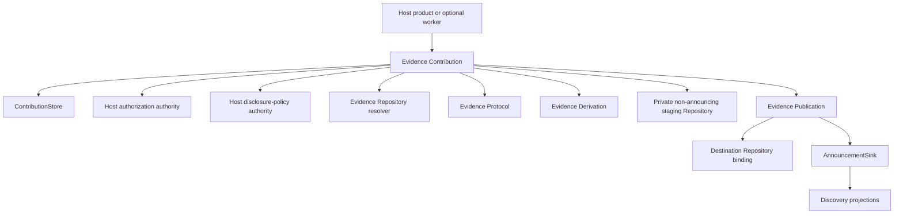

# Evidence Contribution Design

- **Status:** Approved; implementation planning completed on 2026-07-27
- **Date:** 2026-07-26
- **Scope:** Application-level Evidence disclosure orchestration
- **Implementation status:** Design and implementation plan complete; implementation has not begun.

## 1. Decision

Evidence Contribution is a host-neutral, embeddable workflow library with a canonical durable
application state machine and injected authority-bearing ports.

It takes one exact Evidence Protocol record, prepares an exact disclosure under caller-supplied
policy, binds authorization to that disclosure and its destinations, invokes the existing
Publication substrate once per destination, and returns a durable per-destination outcome.

Contribution is not:

- a fourth Evidence Protocol record family;
- a publication bundle or repository;
- a derivation or scrubbing implementation;
- a mandatory service, daemon, queue, or public API;
- an eligibility, trust, admission, reward, or marketplace system; or
- an implication of successful Evidence capture.

A host may invoke the library directly, on application startup, or continuously from an optional
worker. Progress is durable, but the shared capability does not promise forward progress while no
host process is running.

The technical capability may be called **Evidence Contribution**. In user-facing Jinn surfaces,
the published unit remains an **Attempt** under `GLOSSARY.md`; *contribute* remains the action.

## 2. Rationale

Derivation and Publication settle the mechanical safety and delivery layers, but they deliberately
do not answer these application questions:

- Which exact private Evidence record is being proposed?
- Which disclosure policy and transformation implementation apply?
- Which exact output will the authorizer approve?
- Is authorization one-time, organization-controlled, or prospective under a standing grant?
- Which destinations are authorized?
- When may an irreversible effect begin?
- How should several destination outcomes be presented and resumed as one user operation?
- What does deactivation mean when immutable bytes may remain distributed?

These semantics are sufficiently shared and safety-critical to justify one reusable capability.
Leaving them to each product would duplicate the hardest privacy, authorization, and recovery
logic. Making them a required service would add an unnecessary deployment, identity, credential,
and availability boundary.

The decision supports Jinn's principles:

- **Neutral and permissionless:** the package has no privileged product, repository binding,
  destination, identity provider, wallet, or chain.
- **Governance minimal:** eligibility and product policy remain injected instead of becoming
  network-wide rules.
- **Legible:** exact source, transformation, authorization, publication, and deactivation outcomes
  remain independently inspectable.
- **Learning maximised:** safe contribution is reusable across plugins, marketplaces, benchmarks,
  datasets, skills, and third-party agent hosts.

## 3. Substrate stocktake and authority

The design was derived from the current stacked Evidence work rather than obsolete `next` paths.
The review included the public foundation, Repository-capability, and Derivation PR stack
(PRs #2187 through #2189), plus the newer local Derivation, Publication, IPFS Repository, and
Publication-design heads available during the design session.

The relevant settled boundaries are:

| Capability | Authority used by Contribution |
| --- | --- |
| Evidence Protocol | Three canonical record families, exact serialization identity, public-derivative rules, and independent append-only claims |
| Evidence Repository | Exact content-addressed record and artifact bytes; injected bindings; no listing, deletion, trust, retention, or visibility semantics |
| Execution Recorder | Durable private Execution Evidence and an exact final receipt; capture never implies publication |
| Attestation Issuer | Exact signed Result Evaluation and Execution Verification records; prepare and commit are separate |
| Derivation | I/O-free transformation of one Execution Evidence record into `publishable-unchanged`, `derived`, `review-required`, or `withheld` |
| Publication | One destination per operation; deterministic bundle identity; artifacts, then records, then announcements; durable recovery journal |
| AnnouncementSink | Deterministic announcement preparation, placement, and uncertain-effect reconciliation |
| Discovery | Record locations and availability observations remain distinct from record identity, conformance, trust, and admission |
| Local Evidence Runtime | Optional embeddable local Repository and Discovery composition; not a Contribution dependency |

Contribution composes these contracts. It does not create a second Evidence format, Repository,
Publication journal, bundle, announcement frame, or provenance model.

## 4. Alternatives considered

### 4.1 Reusable workflow library — selected

A shared library owns Contribution requests, exact previews, authorization bindings, aggregate
state, recovery, and receipts through injected capabilities.

This centralizes safety semantics while leaving user experience, actor authentication, credentials,
policy, and scheduling with the host. Local applications can run without a server, and hosted
applications can run the same engine in a worker.

### 4.2 Mandatory durable service — rejected as the base capability

A service would offer language-neutral access and continuous processing, but it would also require
another deployment, account and authorization boundary, credential store, and availability
dependency. It is a poor default for local plugins and CLIs and is unnecessary under the approved
resume-on-invocation model.

A future service may wrap the library without changing its domain contracts.

### 4.3 Product-specific orchestration — rejected

Allowing every product to call Derivation and Publication directly would maximize local freedom
but duplicate authorization, preview, partial-outcome, deactivation, and crash-recovery rules.
The existing plugin flow demonstrates the resulting coupling between eligibility, task mining,
consent, minting, and publication state.

Products still own product orchestration; they do not redefine Contribution semantics.

## 5. Ownership boundary

### 5.1 Contribution owns

- one durable request identity for one primary Evidence record;
- source selection by exact family and digest;
- preparation orchestration and validation of prepared output;
- an immutable disclosure manifest and exact preview identity;
- one-time and standing-authorization semantics;
- binding authorization to source, output, policy, implementation, and destinations;
- per-destination invocation of Publication;
- application-level recovery and duplicate suppression;
- per-destination outcome projections and an aggregate result;
- honest deactivation semantics; and
- private operational receipts.

### 5.2 The host owns

- selecting which conforming Evidence to propose;
- product eligibility and whether a proposal should exist;
- supplying an exact disclosure-policy decision, policy bytes, and allowed transformation
  implementation;
- actor authentication, roles, and authority to grant consent;
- user interface, preview rendering, warnings, and protected human review;
- Repository and destination credentials;
- destination configuration;
- process scheduling and worker operation;
- private-source retention and garbage collection;
- trust, admission, ranking, corpus inclusion, rewards, and settlement; and
- opaque product correlation, such as a plugin Attempt or marketplace assignment.

Contribution accepts approved host decisions. It does not infer eligibility or permission from
repository visibility, Git history, a license, an Evidence signature, or earlier user behavior.
Product eligibility is complete before a request is proposed and is not a Contribution input or
result. Disclosure safety is separate: Contribution requires a source-bound policy decision and
fails closed when one is absent or invalid.

### 5.3 Existing substrate owns

- Capture owns recording what happened.
- Protocol owns Evidence structure, identity, and conformance.
- Repository owns exact byte persistence.
- Derivation owns transformation algorithms and provenance.
- Publication owns exact destination bundle construction, write ordering, announcement placement,
  and low-level recovery.
- AnnouncementSink owns its exact announcement frame and external placement protocol.
- Discovery owns queryable availability projections.
- Attestation Issuer owns signed Evaluation and Verification construction.

### 5.4 Dependency graph



No Evidence package imports plugin, marketplace, Autopilot, wallet, blockchain, OCI, IPFS, or UI
concepts. Concrete bindings enter through ports.

## 6. Component and package structure

The capability belongs in one independently publishable package:

```text
packages/evidence/contribution/
  package.json
  README.md
  src/
    public commands and read models
    request, manifest, authorization, outcome, and receipt contracts
    workflow engine and state-transition rules
    injected port contracts
    safe errors and operational events
  testing/
    portable host-integration contract suites
    in-memory deterministic doubles
```

The package should be published as `@jinn-network/evidence-contribution`.

The root package remains medium-neutral and imports other Evidence capabilities through their
public package contracts. It has no filesystem, network, credential, wallet, chain, or product
dependency.

Reusable adapters may be added only when more than one consumer genuinely needs the same binding.
Plugin, marketplace, and other product adapters stay in their owning packages. An optional process
or RPC wrapper is deferred and must remain a wrapper around this package.

## 7. Protocol subjects and source selection

Contribution accepts exactly one primary `EvidenceRecordReference` from the Repository contract's
closed family union:

| Record family | Protocol form | Contribution preparation |
| --- | --- | --- |
| `execution-evidence` | RO-Crate describing one Execution and its Task, Results, runtime, trace, inputs, and provenance | Derive under exact policy unless an already-prepared public disclosure is safely reusable |
| `result-evaluation` | Signed DSSE/in-toto claim about exact Task and Result subjects | Validate and disclose the signed envelope byte-for-byte or withhold |
| `execution-verification` | Signed DSSE/in-toto claim about one exact Execution Evidence record | Validate and disclose the signed envelope byte-for-byte or withhold |

Task, Result, Runtime Specification, Runtime Observation, trace, and conformance report are not
standalone record families. They may be artifacts or entities referenced by a primary record, but
they cannot be primary Contribution subjects.

### 7.1 Source selection

A source selection contains:

- an opaque, deployment-local Repository binding ID;
- one exact Evidence record family and SHA-256 digest; and
- optional safe opaque host correlation.

The binding ID resolves to an injected `EvidenceRepository`. It is not a portable Evidence
location and is not part of canonical Evidence identity.

Contribution loads the exact bytes, verifies their digest, validates the declared record family,
and loads only the artifact bytes required by the selected preparation policy. A missing or
mismatched source fails closed without modifying the private Repository.

### 7.2 Already-public sources

Already-public conforming Evidence does not automatically bypass preparation. Contribution may
reuse an earlier prepared disclosure only when the caller supplies:

- the exact prepared record and artifact references;
- a verifiable prior Derivation outcome or an unchanged signed record;
- the exact policy and implementation identities required by the current request; and
- bytes that still match every referenced digest.

Otherwise the record is prepared again locally. Reuse never changes Evidence identity and never
imports an earlier authorization for a new destination.

## 8. Derivation and disclosure policy

Contribution does not select or interpret product eligibility. The caller supplies a private,
immutable disclosure-policy decision bound to the exact source record. A host policy authority
verifies that decision before preparation.

The decision has one family-appropriate disposition:

- derive Execution Evidence under referenced exact policy and implementation inputs;
- disclose an exact signed Evaluation or Verification unchanged with an exact allowed companion
  artifact set; or
- withhold the record.

For Execution Evidence, the caller also supplies exact disclosure-policy bytes and the allowed
Derivation implementation and configuration identities. Exact public-safe policy and implementation
descriptor bytes are stored by reference in the private staging Repository for recovery. Secret
detector or allowlist configuration remains behind the host's Derivation resolver; only its
content-bound configuration digest enters the request.

The policy decision and its input digests become part of the sealed request intent and disclosure
manifest. A disclosure-policy decision is a safety input, not publication authorization. Neither
interactive nor standing authorization can override a `withheld` or `review-required` result.

### 8.1 Execution Evidence

For private Execution Evidence, Contribution:

1. resolves the exact source record and available source artifacts;
2. supplies them to `EvidenceDeriver` with exact policy bytes, exact public implementation
   descriptor bytes, and a supplied completion time;
3. accepts only one of the Derivation contract's four outcomes; and
4. validates and stages only bytes returned in a publishable outcome.

Outcome handling is fixed:

- `publishable-unchanged`: use the byte-identical source record and returned safe artifacts.
- `derived`: use the new conforming record, returned publishable artifacts, scrub receipt, and
  binding-impact report.
- `review-required`: retain private findings only in the host's protected review system; store no
  publishable payload in Contribution state.
- `withheld`: retain only stable content-free reasons; publish nothing.

A human exception never changes an outcome in place. The host records a narrow review decision,
changes the exact policy input, and creates a linked request that prepares a new exact disclosure.

The derived record retains protocol-required source commitments and provenance. Contribution does
not reproduce or edit that provenance. It does not expose unavailable private bytes or their local
locations.

Related private Result Evaluation or Execution Verification records are never discovered and
copied automatically. The one-record request boundary and Derivation's binding-impact contract
prevent claims from silently transferring to a derivative.

### 8.2 Signed Evaluation and Verification records

Result Evaluation and Execution Verification envelopes are immutable signed records. Contribution
never sends them through Derivation and never redacts or rewrites them.

If a signed record contains material that cannot be disclosed, it is withheld. Its issuer must
create and sign a new disclosure-safe claim. Exact companion artifacts may be included or omitted
only as listed in the verified source-bound disclosure-policy decision, but the signed envelope
itself remains byte-identical.

## 9. Durable application models

All durable Contribution structures are private operational records. They are not Evidence
Protocol claims, trust assertions, Publication bundles, or public announcements.

### 9.1 Contribution request

A request contains:

| Field | Meaning |
| --- | --- |
| `schemaVersion` | Version of the private application record |
| `requestId` | Stable opaque identity for the workflow |
| `idempotencyKey` | Optional caller key used to suppress duplicate creation |
| `source` | Repository binding ID plus exact primary record reference |
| `disclosureIntent` | Exact source-bound policy-decision reference, policy and implementation input references and digests, completion time, and preparation mode |
| `destinations` | Non-empty set of immutable destination descriptors |
| `createdAt` | Host-supplied time |
| `hostContext` | Optional opaque product correlation with no Contribution semantics |
| `supersedes` | Optional link to a replaced request |

Before preparation, a host may abandon and recreate a proposal. Beginning preparation seals an
intent fingerprint. Changing source, policy, implementation, artifact selection rules, or
destinations after that point creates a new linked request rather than mutating the old one.

The request identifies one primary record but may target several destinations. Several related
Evidence records require several requests.

### 9.2 Prepared disclosure manifest

A publishable preparation produces exact staged bytes plus a private immutable manifest containing:

- manifest schema version and request ID;
- sealed intent fingerprint;
- exact source record reference;
- exact publishable record reference;
- the sorted publishable artifact-reference set;
- preparation mode: unchanged, derived, signed-unchanged, or verified reuse;
- the exact source-bound disclosure-policy decision identity and digest;
- Derivation policy, implementation, receipt, and binding-impact identities where applicable;
- safe unavailable-artifact and source-commitment facts;
- every destination's stable IRI, profile, safe display descriptor, configuration digest, and
  declared deactivation or immutability capabilities;
- the Publication `bundleKey` and `payloadFingerprint` deterministically derived for each
  destination from the exact Publication input; and
- standardized irreversibility and correlation-risk disclosures.

The manifest is serialized deterministically as a versioned private application record and hashed.
That hash is the **preview fingerprint**.

The destination configuration digest covers non-secret routing semantics that determine where and
how disclosure occurs. It excludes credentials and other secrets. Rotating a credential does not
invalidate authorization when the destination semantics are unchanged; resolving a different
endpoint, repository, profile, or announcement medium does.

This manifest is not a second Evidence package or Publication bundle. It is an authorization
commitment over references and substrate-derived identities. Publication remains the sole owner of
destination bundle and announcement bytes.

### 9.3 Authorization records

Authorization has three explicit modes:

| Mode | Meaning |
| --- | --- |
| `interactive-exact` | The host asserts that an authenticated user was shown the exact prepared disclosure and approved selected destinations |
| `organization-exact` | An external authority approves the exact prepared disclosure without claiming that a human preview occurred |
| `standing-grant` | A previously created prospective grant matches the prepared disclosure and an allowed destination |

An exact authorization record contains:

- a stable decision ID;
- mode;
- authority and authenticated actor references;
- preview fingerprint;
- allowed destination IDs;
- decision time and optional expiry;
- authorizing policy or external proof digest; and
- safe denial reasons for destinations not allowed.

Cryptographic proof may be supplied and verified by the host authority, but a signature proves key
control rather than informed consent, identity trust, or Evidence truth.

A standing grant contains:

- stable grant ID and version;
- authority and actor;
- explicit source or host scope;
- allowed record families;
- allowed disclosure-policy authority or profile plus policy and
  transformation-implementation digests;
- allowed destination configuration digests;
- optional expiry and resource bounds;
- optional host-specific scope claims; and
- append-only revocation state.

The user may deliberately choose a broad scope, but no scope is inferred. A standing grant is
matched only after an exact disclosure exists. It never matches `review-required` or `withheld`.

Authorization records stay private unless another application independently decides to publish
them as a different, valid record type. Contribution does not turn them into Evidence claims.

### 9.4 Per-destination progress

Each destination has independent authorization, Publication, and deactivation facets:

- authorization: awaiting, authorized, denied, expired, or revoked;
- publication: not-started, publishing, published, retryable-failure, or terminal-failure; and
- deactivation: active, requested, reconciling, deactivated, or unsupported.

The progress record refers to Publication's deterministic bundle key, payload fingerprint, journal
identity, and eventual `PublicationReceipt`. It does not copy Publication's artifact, record, or
announcement checkpoint state.

### 9.5 Contribution receipt

A completed or deliberately closed request produces a private receipt containing:

- receipt version and request ID;
- sealed intent and preview fingerprints when preparation reached those boundaries;
- source Evidence reference;
- unchanged or derived Evidence reference and exact artifact references when publishable output
  existed;
- source-bound disclosure-policy decision identity and digest;
- Derivation outcome and receipt references where applicable;
- authorization mode and decision or standing-grant identity when authorization occurred;
- for each destination:
  - destination identity and configuration digest;
  - Publication bundle key and payload fingerprint;
  - exact published record and artifact references;
  - binding-supplied `PublishedEvidenceLocation` values when available;
  - announcement frame and placement identities, including the sink's external placement ID;
  - publication and deactivation outcome;
  - safe retryable or terminal error code; and
- aggregate completion time and status.

The receipt is an operational audit record. It does not imply evaluation, verification, identity
trust, public admission, search visibility, reputation, marketplace acceptance, reward, corpus
membership, or deletion of any bytes.

## 10. Application-facing command boundary

The public command surface freezes behavior without prescribing a UI:

| Command | Effect |
| --- | --- |
| Create request | Persist a proposed request or return the existing request for the same caller idempotency key and identical input |
| Prepare | Seal intent, resolve and validate source bytes, invoke family-appropriate preparation, stage publishable bytes, and create the exact manifest |
| Decline | Before the first external effect, record the minimum private decision fact and prohibit external effects |
| Authorize exact | Verify and record an interactive or organization-controlled decision for selected destinations |
| Create standing grant | Verify and persist an explicit prospective authorization scope |
| Revoke standing grant | Append revocation and prevent not-yet-started matched effects |
| Resume | Advance only transitions currently permitted by durable state and authorization |
| Retry destination | Re-enter the same exact Publication operation for a retryable destination |
| Deactivate destination or request | Checkpoint no-new-effects intent and attempt supported availability withdrawal |
| Inspect | Return a safe read model, exact manifest access, and current per-destination outcome |
| Read receipt | Return the private final or current aggregate receipt |

Commands accept request IDs and expected state versions where mutation is possible. They are safe
to repeat after an ambiguous client response.

The engine uses these injected ports:

- `ContributionStore`: create, load, compare-and-swap, work-claim, and auditable decision/outcome
  persistence;
- `RepositoryResolver`: resolve opaque source and staging Repository bindings;
- `DisclosurePolicyAuthority`: verify the source-bound policy decision and its permitted
  family-specific preparation route;
- `DerivationResolver`: resolve the expected implementation and private configuration digests to
  the existing `EvidenceDeriver` contract without exposing secret configuration;
- `PublicationResolver`: resolve a destination IRI to Publication dependencies, its safe
  descriptor, and any binding-owned location projection without exposing credentials;
- `AuthorizationAuthority`: verify actor authority, exact decisions, standing grants, revocation,
  and host-specific scope claims;
- `ReviewReferenceStore`: retain private findings outside Contribution state and return an opaque
  reference; and
- injected clock and identifier sources for auditable, deterministic operation.

A host may expose a worker that enumerates resumable request IDs, but worker scheduling is not part
of the normative engine.

## 11. Preview and authorization boundary

### 11.1 What the preview represents

The host renders the prepared disclosure manifest and provides access to the exact staged record
and artifact bytes. The authorizer must be able to understand:

- which Evidence record family is being disclosed;
- whether the record is unchanged, derived, signed unchanged, or reused;
- which exact artifacts accompany it and which remain unavailable;
- which provenance and source commitments remain visible;
- whether Task or Result identities changed and how claim bindings are affected;
- every destination and its expected Publication identities;
- destination-specific permanence, withdrawal limitations, and possible fees or remote effects;
- that publication does not imply trust, admission, reward, or deletion guarantees; and
- that content digests may permit correlation or guessing of known private material.

The UI may summarize or progressively disclose information, but the summary is not authoritative.
The preview fingerprint binds the exact manifest and staged bytes by digest.

The Evidence record and artifact bytes are the approved disclosure payload. Publication's
destination packaging and AnnouncementSink frames may be produced later by their owning
substrates. Authorization binds their exact Evidence inputs, deterministic Publication identities,
destination configuration, and sink profile; Contribution does not prebuild or reinterpret their
frames. Eventual announcement frame digests and placement identities appear in the receipt.

### 11.2 Change invalidation

Any change to source, prepared record, artifact set, policy, transformation implementation,
destination configuration, or expected Publication identity changes the manifest fingerprint.
Existing exact authorization cannot apply to the changed request.

Retries do not require new authorization because they reuse the same manifest, Publication input,
bundle key, and payload fingerprint.

### 11.3 Destination-specific decisions

An authorization action may approve any subset of the request's destinations. Approval of one
destination never implies approval of another. Denied or unauthorized destinations do not start.

Several requests may be displayed in one product review session and approved with one user action,
but each request receives an exact decision bound to its own manifest and destinations.

### 11.4 Authorization timing

- Interactive exact authorization occurs only after a preview exists.
- Organization exact authorization occurs only after an exact manifest exists.
- A standing grant may be created prospectively, but its match is evaluated only after
  preparation and again immediately before each destination's first possible external effect.
- Expiry or revocation before that effect blocks the destination.
- Once Publication may have produced an effect, withdrawal becomes deactivation and reconciliation;
  revocation cannot imply erasure.

## 12. State model

Contribution requires durable application state, but it does not duplicate Derivation or
Publication's internal state machines.

### 12.1 Preparation facet

```text
proposed
  ├── declined
  └── preparing
        ├── review-required
        ├── withheld
        └── preview-ready
              └── declined before first external effect
```

- `proposed` has no publication authority.
- `declined` may occur before preparation or after preview but before any external effect. It has
  no remote side effect and does not alter canonical Evidence.
- `review-required` contains an opaque protected-review reference and no publishable payload.
- `withheld` contains only safe reason codes and no publishable payload.
- `preview-ready` means exact bytes are staged locally; it does not mean authorized or published.

### 12.2 Destination facets

Each preview-ready destination proceeds independently:

```text
awaiting-authorization
  ├── denied / expired / revoked
  └── authorized
        └── publishing
              ├── published
              ├── retryable-failure
              └── terminal-failure
```

Deactivation is an orthogonal facet because it may be requested before, during, or after
Publication.

### 12.3 Aggregate read states

The engine derives, rather than separately mutates, an application-level summary:

| Aggregate | Meaning |
| --- | --- |
| `proposed` | Awaiting local preparation or decline |
| `preparing` | Local source validation or Derivation is active |
| `review-required` | Human safety review is required |
| `withheld` | Safety policy produced no publishable payload |
| `awaiting-authorization` | At least one destination lacks sufficient authorization |
| `publishing` | At least one authorized destination remains active |
| `attention-required` | Destinations have mixed success, denial, or failure requiring a host decision |
| `completed` | At least one destination has a completed Publication receipt and every other destination was completed, explicitly denied, or deactivated |
| `declined` | The request was closed before any remote effect, including an all-destinations denial after preview |
| `deactivated` | No destination remains active; past immutable effects may remain |

There is no all-destinations transaction and no single terminal `failed` state that hides partial
success.

## 13. Publication and announcement orchestration

Contribution invokes Publication once per authorized destination. It supplies:

- the one exact primary record returned by preparation;
- only the exact publishable artifact bytes listed in the manifest; and
- the exact destination IRI included in authorization.

Before an external call, Contribution:

1. checks the current request version and work claim;
2. revalidates authorization and deactivation state;
3. loads and digest-verifies the staged bytes;
4. derives and verifies Publication's deterministic bundle key and payload fingerprint;
5. checkpoints the intended operation identity; and
6. releases its state-store update before doing network or binding I/O.

Publication then owns the ordered operation:

1. store artifacts;
2. store records;
3. prepare deterministic announcement partitions;
4. checkpoint announcement intent;
5. place or reconcile announcements; and
6. return a completed `PublicationReceipt`.

Contribution marks a destination `published` only after Publication returns a completed receipt.
Repository writes without confirmed announcement placement remain an interrupted Publication, not
a completed Contribution destination.

Contribution never calls Repository writes or AnnouncementSink placement as an alternative path
around Publication.

## 14. Recovery, concurrency, and idempotency

### 14.1 Stable identities

These identities remain stable across retries:

- caller idempotency key and Contribution request ID;
- sealed intent fingerprint;
- source-bound disclosure-policy decision digest;
- source and prepared Evidence references;
- preview fingerprint;
- authorization decision or standing-grant version;
- destination IRI and configuration digest;
- Publication bundle key and payload fingerprint;
- Publication journal identity; and
- confirmed announcement placement identities.

Changed source, policy, implementation, artifact selection, or destination configuration creates a
new request. It is never treated as a resume.

### 14.2 ContributionStore concurrency

The store uses versioned compare-and-swap updates and short-lived work claims. A claim prevents
wasteful concurrent work but is not the correctness boundary. Correctness comes from immutable
inputs, state-version checks, deterministic identities, and Publication idempotency.

Contribution never holds a durable state-store lock across Derivation, Repository, Publication, or
AnnouncementSink I/O.

### 14.3 Crash recovery

After a crash, another invocation may reclaim a request and:

- reuse an existing prepared disclosure rather than derive conflicting bytes;
- reload the same staged bytes by exact digest;
- invoke Publication with the same operation identity;
- allow Publication to inspect its journal and reconcile pending placements; and
- checkpoint the one resulting receipt.

A crash after artifacts or records are stored but before announcement does not create a second
bundle or announcement identity. Publication resumes its journal.

### 14.4 Duplicate submission

The same caller idempotency key with the same normalized request returns the existing request. The
same key with different material input is a conflict. Semantically similar requests without a
shared key are distinct and do not share authorization implicitly.

## 15. Failure model

Errors are safe, structured, and classified:

| Class | Examples | Application meaning |
| --- | --- | --- |
| Source | missing record, digest mismatch, wrong family, unavailable required artifact | Cannot prepare; private source remains untouched |
| Conformance | invalid Execution Evidence, Evaluation, or Verification structure | Terminal safety rejection for this exact source |
| Derivation policy | invalid policy, missing required detector, protected-value conflict | Terminal until a new request changes exact inputs |
| Review | unresolved sensitive finding | Paused; no publishable payload |
| Withholding | policy withholds artifact or record | Safe terminal result; no remote effect |
| Authorization | missing, denied, expired, revoked, stale manifest, authority failure | No new destination effect |
| Binding capability | object too large, unsupported destination profile | Terminal for that destination configuration |
| Access | missing credential, denied Repository or sink access | Usually retryable after host repair |
| Publication | repository, journal, or announcement interruption | Retry through the same Publication operation |
| State integrity | corrupt record, rollback, impossible transition, operation mismatch | Fail closed for operator attention |
| Deactivation | unsupported withdrawal or unresolved in-flight effect | Honest per-destination limitation |

Errors and logs may contain request IDs, digests, state names, destination IDs, operation IDs,
bounded counts, and stable content-free codes. They must not contain private Evidence bytes,
snippets, paths, credentials, detector findings, wallet material, or opaque sink state.

## 16. Deactivation and withdrawal

The application exposes **Deactivate sharing**, not deletion.

Deactivation:

1. durably records that no new external effect may begin;
2. prevents not-started destinations from entering Publication;
3. reconciles in-flight Publication because an external effect may already exist;
4. requests a withdrawal or unavailability observation through an explicit destination capability
   where supported; and
5. records `deactivated`, `unsupported`, or a retryable deactivation failure per destination.

Normal availability announcements remain owned by Publication and AnnouncementSink. Deactivation
uses an optional availability-withdrawal capability backed by the relevant binding or Discovery
announcement semantics; it does not invent deletion on the Repository contract.

The application must state clearly:

- mutable announcements, aliases, or pins may be withdrawn only where supported;
- one source cannot retract another source's availability observation;
- OCI, IPFS, caches, mirrors, and downloaded copies may remain retrievable;
- the historical Evidence record is never rewritten; and
- deleting local staging bytes does not delete public content.

## 17. Storage lifecycle

### 17.1 Contribution state

`ContributionStore` retains:

- private operational request metadata;
- immutable manifest, decision, grant, revocation, and receipt bytes or references;
- safe state projections and error codes;
- Publication operation identities; and
- an audit history sufficient to explain every authority-bearing transition.

It does not retain Evidence payloads, credentials, secret policy configuration, or review findings.
Mutable projections may be rebuilt or compacted only while immutable decisions and receipts remain
auditable under host retention policy.

### 17.2 Source and staging bytes

Evidence bytes remain in injected Repositories:

- the private source remains under capture or host retention policy;
- exact policy bytes, public implementation descriptors, and publishable output are staged in a
  private non-announcing Repository before they are needed for recovery or preview;
- secret detector and allowlist configuration remains in the host authority and is resolved by its
  content-bound digest;
- active or retryable requests retain all staged bytes required for deterministic recovery;
- declined, withheld, terminal, or deactivated requests may release staging retention after host
  audit requirements are satisfied; and
- completed requests may release staging retention after exact destination receipts are durable.

Contribution reports live record and artifact references but never deletes them. The host owns
retention enforcement and garbage collection.

## 18. Required application flows

### 18.1 Private plugin execution

1. Execution Recorder finalizes private Execution Evidence and returns its exact receipt.
2. Capture stops; no contribution is implied.
3. The plugin separately proposes the record and destinations.
4. Contribution resolves exact local bytes and invokes Derivation under exact policy.
5. A publishable derivative is staged privately.
6. The plugin renders the exact manifest, output bytes, provenance, binding impact, destinations,
   and irreversibility warning.
7. The user authorizes selected destinations.
8. Contribution invokes Publication once per authorized destination.
9. Publication stores exact derivative artifacts and record, then announces availability.
10. Contribution returns the durable receipt. Private source bytes remain local.

### 18.2 Contribution declined

If the user declines before preparation, no Derivation, remote Repository write, or announcement
occurs. If the user declines after local preparation, staged bytes remain private and become
eligible for host garbage collection. Canonical Evidence is unchanged. The product retains only
the minimum private operational fact it needs.

### 18.3 Non-interactive organization policy

An external authority supplies either an exact organization decision or a verifiable standing
grant. Contribution records `organization-exact` or `standing-grant`, never
`interactive-exact`. The same local preparation, exact manifest, authorization binding,
Publication, recovery, and receipt rules apply. No receipt falsely claims that a human saw a
preview.

### 18.4 Already-public Evidence to an additional location

The caller supplies an already-public exact record as the source and requests a new destination.
Contribution validates safe reuse or prepares it again, creates a new exact destination-bound
manifest, and obtains matching authorization. Publication adds another location for the same
canonical record. Transport identity and location change; Evidence identity does not.

### 18.5 Evaluation contributed later

Attestation Issuer creates a signed Result Evaluation after an Execution and its Results are
public. The Evaluation becomes a new independent request. Contribution validates and publishes the
exact signed envelope, optionally with allowed companion artifacts. It refers to the existing Task
and Result digests; no Execution Evidence record is rewritten.

### 18.6 Interrupted Publication

Derivation and staging complete. Publication stores some objects, then the process stops before
announcement confirmation. On restart, Contribution reloads the same request and exact staged
bytes. Publication resumes its existing journal, reuses completed writes, reconciles uncertain
announcement placement, and returns one stable receipt.

### 18.7 Multiple destinations

The same approved disclosure targets OCI and IPFS through two Publication operations. The
canonical record and artifact identities remain the same; destination, bundle, location, and
announcement identities remain distinct. Success at one destination does not imply success at the
other. Mixed outcomes are visible, and retry reuses only the failed destination's exact operation.

### 18.8 Deactivation

The contributor deactivates a completed or partially completed request. No pending destination
starts. In-flight work reconciles. Supported bindings retract the contributor's availability
observation; unsupported bindings report the limitation. Immutable or downloaded bytes may remain,
and no historical Evidence record is rewritten.

## 19. Security and privacy boundary

Contribution fails closed at the disclosure boundary.

### 19.1 Mandatory protections

- **Raw-private publication:** Publication input is constructed exclusively from a validated,
  immutable prepared manifest and its staged bytes, never directly from the private source
  selection.
- **Source or derivative substitution:** every loaded record and artifact is digest-verified;
  family and Protocol conformance are rechecked.
- **Preview time-of-check/time-of-use:** authorization commits to the manifest fingerprint;
  staged bytes, policy, implementation, and destination identities are reverified before effects.
- **Unresolved findings:** `review-required` has no publishable output and never matches a standing
  grant.
- **Private claims:** related Evaluation and Verification records are not traversed or copied.
- **Transformation compromise:** policy and implementation digests are authorized; output is
  Protocol-validated; the preview remains the final disclosure boundary. Automated grants
  explicitly accept the configured implementation risk.
- **Destination substitution:** destination IRI, profile, safe descriptor, configuration digest,
  bundle key, and payload fingerprint are authorization-bound.
- **Credential isolation:** repositories, sinks, signers, and external authorities retain their
  credentials; only opaque binding IDs cross the engine.
- **Replay and staleness:** request, manifest, authorization, grant version, expiry, revocation,
  and state version must all match.
- **Cancellation during irreversible work:** no blind rollback is claimed; in-flight Publication
  reconciles before status changes.
- **Duplicate announcement:** Publication's deterministic preparation, idempotency keys, pending
  placement state, and reconciliation remain authoritative.
- **Resource exhaustion:** Repository and sink capability limits plus host-supplied request,
  artifact-count, byte, and concurrency bounds are checked before effects.
- **Local path safety:** the core accepts Repository bytes, not arbitrary filesystem paths. Local
  adapters remain responsible for non-following opens, symlink defenses, containment, bounded
  reads, ownership, permissions, and the documented same-privilege threat boundary.

### 19.2 Correlation and commitments

A public derivative may retain commitments to unavailable private source material. Those
commitments support provenance but can permit dictionary or correlation attacks when source
content is guessable. The exact commitments and policy-provided risk classification appear in the
private preview. Contribution does not claim that a digest is anonymous.

### 19.3 Trust statement

A completed receipt establishes only:

- the exact prepared Evidence references;
- the recorded authorization mode and identity;
- the Publication operations attempted; and
- their reported destination outcomes.

It does not establish Evidence truth, signature identity binding, consumer trust, evaluator
quality, marketplace eligibility, public admission, corpus membership, reward, or reputation.

The Contribution store and Publication journals are crash-recovery and audit mechanisms, not
cryptographic trust anchors against an attacker with equivalent write privileges. Corrupt or
rolled-back state fails closed.

## 20. Product integration examples

### 20.1 Jinn Plugin

The plugin adapter:

- accepts the Execution Recorder receipt;
- lets plugin policy decide whether to propose the Attempt;
- supplies local Repository, disclosure policy, authenticated actor, destinations, and UI;
- renders Contribution's safe read model and exact manifest;
- invokes authorization, resume, retry, and deactivation commands; and
- translates the receipt into product presentation.

Candidate eligibility, local task mining, dataset construction, marketplace state, mint status,
wallet operations, reward, and settlement remain outside the adapter.

### 20.2 Marketplace operator

A marketplace operator may contribute Execution Evidence produced by a worker or a later signed
Evaluation. Marketplace Task, Attempt, assignment, delivery, verdict, and settlement records stay
marketplace-owned. Stable marketplace references may exist inside Evidence or in opaque
`hostContext`, but Contribution never interprets them.

Marketplace admission or reward policy determines whether to propose a request. Contribution then
uses the same exact preparation, authorization, Publication, and receipt semantics as any other
host.

### 20.3 Third-party agent host

A third-party host installs the standalone package, supplies implementations of the Repository,
ContributionStore, authorization, review, and destination ports, and runs the portable contract
suite. It may invoke requests interactively or from an organization-controlled worker. It does not
need Jinn Plugin, Autopilot, marketplace, wallet, chain, IPFS, or OCI code unless it selects those
specific bindings.

### 20.4 Dataset, Benchmark, or Skill application

These products may propose outputs only when the primary subject is one of the three Evidence
record families. Contribution does not accept a standalone Task, dataset row, benchmark case, or
Skill artifact as a new record family. Product construction and admission occur before or after
Contribution as appropriate.

## 21. Testing and contract conformance

The package exposes a portable testing entrypoint,
`@jinn-network/evidence-contribution/testing`, for every host integration.

### 21.1 Domain tests

- every allowed and forbidden state transition;
- one primary record with one and many destinations;
- exact request, intent, manifest, authorization, and receipt identity;
- duplicate caller idempotency keys and conflicts;
- destination-specific authorization and denial;
- one-time, organization-controlled, and standing authorization;
- source-bound disclosure-policy decisions for all three record families;
- grant scope, expiry, revocation, and broad-but-explicit scopes;
- decline, review, withholding, retry, terminal failure, and deactivation;
- aggregate status derived from mixed destination facets.

### 21.2 Substrate contract tests

- all three Protocol record families and golden fixtures;
- unchanged and derived Execution Evidence;
- Derivation provenance and binding-impact preservation;
- rejection of Task, Result, Runtime, or trace entities as record families;
- exact Evaluation and Verification envelope preservation;
- Repository capability and digest enforcement;
- Publication bundle key, payload fingerprint, receipt, and journal reuse;
- announcement preparation, pending placement, reconciliation, and withdrawal capability;
- safe operation against filesystem, OCI, IPFS, and future destination doubles.

### 21.3 Security tests

- attempted raw-private input to Publication;
- source, output, artifact, policy, implementation, destination, and preview substitution;
- source or policy changes after authorization;
- unresolved sensitive findings under standing authorization;
- accidental transfer of private Evaluation or Verification claims;
- malicious or malformed port return values;
- stale, replayed, expired, and revoked authorization;
- missing credentials and denied access;
- bounded object, manifest, journal, and concurrency behavior;
- symlink and replacement attacks in concrete local adapters;
- proof that state, logs, errors, events, and receipts contain no private payloads, snippets,
  credentials, private findings, or opaque sink state.

### 21.4 Recovery tests

Fault injection occurs before and after every durable boundary:

- source load and validation;
- Derivation completion;
- staging each exact output;
- manifest creation;
- authorization persistence;
- destination intent checkpoint;
- each Publication artifact and record write;
- announcement preparation, intent checkpoint, placement, and reconciliation;
- Publication receipt persistence;
- deactivation request and withdrawal placement.

Tests run two concurrent resumers and prove one stable request, disclosure, Publication operation,
announcement identity, and receipt.

### 21.5 Required integration scenarios

Every product adapter runs fixtures for:

- private-source contribution;
- exact preview-to-Publication binding;
- contribution declined;
- automated organization authorization;
- human-review exception followed by a new request;
- already-public Evidence to a new location;
- later independent Evaluation;
- mixed OCI/IPFS-style outcomes;
- interruption before announcement and successful resume;
- cancellation before and during irreversible effects;
- immutable-publication warning and honest deactivation;
- opaque plugin, marketplace, and third-party host correlation.

Success assertions verify exact Evidence identity and never substitute publication for trust,
admission, or reward.

## 22. Compatibility and versioning

Request, intent, manifest, authorization, grant, state, event, and receipt records have independent
schema versions.

- Unknown major versions fail closed.
- Compatible readers may preserve explicitly permitted extension fields without treating them as
  authority or changing fingerprints.
- Material changes to manifest hashing, authorization binding, destination identity, or state
  semantics require a new major version.
- Existing in-flight requests continue under the version that sealed their intent.
- Evidence Protocol, Repository, Derivation, and Publication identities remain authoritative;
  Contribution never aliases or rewrites them.

The private durable structures are JSON-compatible to permit inspection and future independent
implementations, but they are not a public network protocol. No RPC service or cross-language wire
API is required by this design.

## 23. Explicit non-goals

This design does not include:

- execution capture;
- Evidence Protocol changes or new record families;
- Evidence search, retrieval ranking, or catalog UI;
- Repository or AnnouncementSink implementation;
- Derivation detectors, scrubbing algorithms, or review UI;
- Publication bundle or journal mechanics;
- evaluator execution, verdict generation, or signing-key storage;
- identity resolution or consumer trust policy;
- product eligibility calculation;
- marketplace Task or Attempt lifecycle;
- task mining, Skill generation, dataset construction, or benchmark generation;
- corpus admission or membership;
- settlement, rewards, reputation, or wallet behavior;
- retention enforcement or deletion of canonical local Evidence;
- guarantees that immutable public bytes can be erased;
- plugin-specific UI;
- blockchain anchoring except through a separately injected generic destination;
- a mandatory daemon, queue, ledger, service, or public API; or
- implementation.

## 24. Deferred work

At the user's direction, this specification stops before migration and rollout design.

The following are explicitly deferred:

- migration from the current plugin `ContributionPort`, candidate, ledger, veto, consent, and
  mint-status state;
- treatment of queued legacy items and existing global consent;
- rollout ordering across plugin, marketplace, and third-party integrations;
- any import tool for already-published legacy locations;
- an optional process, RPC, or language-neutral service adapter;
- concrete persistent `ContributionStore` bindings;
- concrete availability-withdrawal bindings; and
- host-specific UI and warning copy.

The integration boundary in Section 20 is normative for future migration work, but this document
does not prescribe a migration or implementation sequence.

## 25. Resolved conclusions

- One request has one primary Evidence record and one or more destinations.
- Related Evaluation and Verification records use independent requests.
- Product UIs may group exact requests without merging their durable identities.
- The core is an embeddable library; an always-running service is optional.
- Resume-on-invocation is sufficient.
- Users may choose exact one-time authorization or explicit scoped standing authorization.
- Standing grants may be broad only by deliberate choice and never bypass safety review.
- Human exceptions create new exact preparation input and a linked request.
- Signed Evaluation and Verification records are unchanged or withheld.
- Destinations are authorized and tracked independently.
- Multi-destination publication is non-atomic and may have mixed outcomes.
- Deactivation stops future activity and retracts availability where supported; it is not deletion.
- Contribution receipts are private operational records, not Evidence or trust claims.

There are no blocking unresolved design questions within the approved scope.
